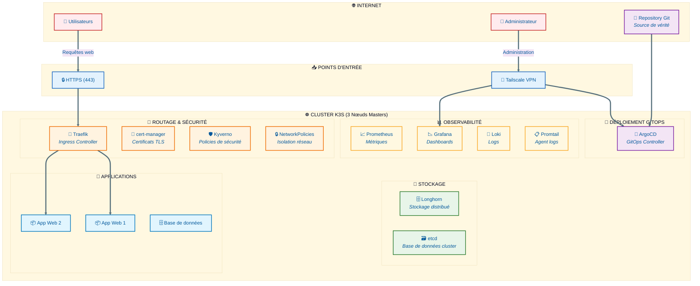

# K3S - V3

# Déployer un cluster K3s sur des VPS Debian 13 chez OVH

> **Objectif :** Monter un cluster K3s haute disponibilité sur 3 nœuds master avec etcd distribué, sur des VPS OVH. Ce cluster contiendra les briques nécessaires pour déployer des applications web (stateless et bases de données). Le trafic inter-nœuds passe par un réseau privé Tailscale, et non par les IP publiques.
> 

---



## Avertissements

**Architecture :** Ce setup utilise 3 masters sans workers dédiés. Les workloads applicatifs tournent sur les masters, ce qui est acceptable pour des charges légères mais pas pour de la production intensive. Avec 3 nœuds etcd, le cluster tolère la perte d’un seul nœud. La perte de 2 nœuds entraîne la perte du quorum et rend le cluster inopérant. Les VPS OVH peuvent avoir des disques limités en IOPS — Longhorn peut être impacté sur des charges I/O intensives.

**Sécurité :** Les IP publiques servent uniquement à l’exposition HTTP/HTTPS via Traefik. L’accès SSH est restreint aux IP Tailscale après la Phase 1. Tout le trafic interne passe par Tailscale. Des règles firewall sont configurées à chaque étape. Les secrets (tokens, credentials) ne doivent jamais être commités en clair dans Git.

**Prérequis :** 3 VPS Debian 13 chez OVH avec IP publique, un accès root SSH aux 3 machines, un compte GitHub, un compte Tailscale (gratuit pour usage personnel), un nom de domaine avec accès à la gestion DNS (nécessaire à partir de la Phase 5), et un poste distant sous WSL2 ou Linux pour l’administration.

---

## Composants déployés

| Composant | Rôle | Phase |
| --- | --- | --- |
| **Tailscale** | Réseau privé chiffré inter-nœuds | Phase 1 |
| **K3s + etcd** | Cluster Kubernetes haute disponibilité | Phase 2 |
| **ArgoCD** | Déploiement GitOps | Phase 3 |
| **Longhorn** | StorageClass distribuée avec réplication | Phase 4 |
| **Traefik** | Ingress Controller | Phase 5 |
| **cert-manager** | Certificats TLS automatisés (Let’s Encrypt) | Phase 6 |
| **Kyverno** | Contrôleur d’admission (policies de sécurité) | Phase 7 |
| **NetworkPolicies** | Isolation réseau inter-namespaces | Phase 8 |
| **Prometheus + Grafana** | Monitoring infrastructure et dashboards | Phase 9 |
| **Loki + Promtail** | Agrégation et consultation des logs | Phase 10 |

---

## Phase 1 : Préparation de l’infrastructure

### Étape 1 — Préparation et sécurisation des nœuds

**À réaliser sur les 3 nœuds.**

### Mise à jour et dépendances

```bash
sudo apt update && sudo apt upgrade -y

# Dépendances de base
sudo apt install -y curl wget gnupg2 software-properties-common apt-transport-https ca-certificates

# Dépendances Longhorn (installées maintenant pour éviter les problèmes plus tard)
sudo apt install -y open-iscsi nfs-common util-linux

# Activer iSCSI
sudo systemctl enable --now iscsid

# Charger le module iscsi_tcp et le rendre persistant
sudo modprobe iscsi_tcp
echo "iscsi_tcp" | sudo tee -a /etc/modules
```

Vérifications :

```bash
sudo systemctl is-active iscsid
# Résultat attendu : active

lsmod | grep iscsi_tcp
# Résultat attendu : iscsi_tcp suivi de chiffres
```

### Désactivation du swap

```bash
sudo swapoff -a
sudo sed -i '/swap/d' /etc/fstab

# Vérification : la ligne Swap doit afficher 0
free -h | grep Swap
```

### Configuration du firewall UFW

> Adapter le port SSH à votre configuration si nécessaire.
> 

```bash
sudo apt install -y ufw

sudo ufw default deny incoming
sudo ufw default allow outgoing

# Autoriser SSH AVANT d'activer le firewall
# Phase initiale : SSH depuis partout (sera restreint à l'étape 3)
sudo ufw allow 22/tcp comment 'SSH temporaire'

# Autoriser tout le trafic sur l'interface Tailscale (configurée à l'étape 2)
sudo ufw allow in on tailscale0 comment 'Tailscale VPN'

sudo ufw enable
```

Vérification :

```bash
sudo ufw status verbose
# Résultat attendu : Status: active, avec les règles SSH et tailscale0
```

### Optimisations système pour Kubernetes

Par défaut, Linux n’est pas configuré pour faire tourner un orchestrateur de conteneurs. Ces paramètres corrigent ça :

- **`br_netfilter`** — Permet à Linux d’appliquer les règles iptables au trafic transitant par les bridges réseau virtuels créés par Kubernetes. Indispensable pour le fonctionnement des NetworkPolicies et du routage des Services.
- **`net.ipv4.ip_forward`** — Autorise le transit de trafic entre interfaces réseau, comme un routeur. Sans ça, un pod sur le nœud 1 ne peut pas communiquer avec un pod sur le nœud 2.
- **`net.bridge.bridge-nf-call-iptables`** — Complément de `br_netfilter`. Soumet le trafic des bridges aux règles iptables pour que Flannel (réseau overlay de K3s) route correctement les paquets entre pods.
- **`fs.inotify.max_user_instances`** et **`max_user_watches`** — Kubernetes surveille en permanence des milliers de fichiers (configs, secrets, logs). Les valeurs par défaut sont trop basses et provoquent des erreurs “too many open files” quand le nombre de pods augmente.

```bash
sudo modprobe br_netfilter
echo "br_netfilter" | sudo tee -a /etc/modules

cat <<EOF | sudo tee /etc/sysctl.d/99-kubernetes.conf
fs.inotify.max_user_instances=8192
fs.inotify.max_user_watches=524288
net.ipv4.ip_forward=1
net.bridge.bridge-nf-call-iptables=1
EOF

sudo sysctl --system
```

Vérification :

```bash
sudo sysctl net.ipv4.ip_forward net.bridge.bridge-nf-call-iptables
# Résultat attendu : les deux valeurs à 1
```

> Les paramètres sont placés dans `/etc/sysctl.d/99-kubernetes.conf` plutôt que dans `/etc/sysctl.conf` pour suivre la convention Debian de configuration modulaire.
> 

---

# Étape 2 — Configuration de Tailscale

Tailscale crée un réseau privé chiffré (WireGuard) entre les nœuds sans exposer les ports sensibles sur Internet. Il simplifie la communication inter-nœuds et offre une authentification forte.

S'authentifier ou créer un compte sur [Tailscale](https://tailscale.com/) au préalable.

---

## Installation sur WSL

```bash
curl -fsSL https://tailscale.com/install.sh | sh
sudo tailscale up --advertise-tags=tag:ssh
# Une URL d'authentification sera affichée.
```

---

## Configuration des tags et ACL sur le dashboard Tailscale

Dans l'onglet **Access Controls**, remplacer le contenu par la politique suivante :

```json
{
  "tagOwners": {
    "tag:node": ["autogroup:admin"],
    "tag:ssh":  ["autogroup:admin"]
  },

  "acls": [
    // Trafic inter-noeuds (K3s, etcd, Flannel, Longhorn, Prometheus)
    {
      "action": "accept",
      "src":    ["tag:node"],
      "dst":    ["tag:node:6443", "tag:node:10250", "tag:node:2379-2380",
                 "tag:node:51820", "tag:node:8472",  "tag:node:9500",
                 "tag:node:9501-9502", "tag:node:8300", "tag:node:10255",
                 "tag:node:9090"]
    },

    // SSH et kubectl depuis WSL
    {
      "action": "accept",
      "src":    ["tag:ssh"],
      "dst":    ["tag:node:22", "tag:node:6443"]
    }
  ],

  "ssh": [
    {
      "action": "accept",
      "src":    ["tag:ssh"],
      "dst":    ["tag:node"],
      "users":  ["debian"]
    }
  ]
}
```

## Installation sur les 3 nœuds

**À réaliser sur les 3 nœuds.**

```bash
curl -fsSL https://tailscale.com/install.sh | sh
sudo tailscale up --advertise-tags=tag:node --ssh
# Une URL d'authentification sera affichée.
# Ouvrir cette URL dans un navigateur pour lier le nœud à votre compte Tailscale.
```

---

---

## Configuration sur le dashboard Tailscale

Sur [le dashboard Tailscale](https://login.tailscale.com/admin/machines) :

1. Renommer les machines : `k3s-master-1`, `k3s-master-2`, `k3s-master-3`
2. Désactiver l'expiration des clés pour chaque machine (Machine settings → Disable key expiry)
3. Vérifier que chaque nœud porte bien le tag `tag:node` et que WSL porte `tag:ssh`

---

## Vérification de la connectivité

```bash
tailscale status

# Récupérer et noter votre IP Tailscale
tailscale ip -4

# Tester la connectivité vers les autres nœuds
ping -c 3 <IP_TAILSCALE_AUTRE_NOEUD>
# Résultat attendu : 0% packet loss
```

> Les IP Tailscale sont dans la plage `100.64.0.0/10`. Elles sont stables tant que la machine reste dans votre réseau Tailscale. Notez les 3 IP pour les étapes suivantes.
> 

---

## Test du firewall

Vérifier que les ports K3s ne sont **pas** accessibles depuis Internet :

```bash
nc -zv <IP_PUBLIQUE_NOEUD1> 6443
# Résultat attendu : Connection refused ou timeout
```

---

### Étape 3 — Durcissement SSH

Une fois Tailscale fonctionnel sur les 3 nœuds **et sur votre poste de travail**, l’accès SSH est restreint au réseau Tailscale. Cela supprime le vecteur d’attaque principal (bruteforce SSH sur IP publique).

**À réaliser depuis WSL, vers les 3 nœuds.**

> **Prérequis critique :** Avant de modifier les règles SSH, vérifier que vous pouvez vous connecter aux nœuds via leur IP Tailscale depuis votre poste.
> 

```bash
# Depuis votre poste — tester la connexion SSH via Tailscale
ssh debian@<NOM_DE_LA_MACHINE_TAILSCALE>
# Résultat attendu : SSH via Tailscale OK
```

### Configuration sshd

> Sur les 3 noeuds:
> 

```bash
# Sauvegarder la configuration actuelle
sudo cp /etc/ssh/sshd_config /etc/ssh/sshd_config.bak

cat <<EOF | sudo tee /etc/ssh/sshd_config.d/99-hardening.conf
# --- Restrictions réseau ---
# Écouter uniquement sur l'IP Tailscale du nœud
ListenAddress $(tailscale ip -4)

# --- Authentification ---
PermitRootLogin prohibit-password
PubkeyAuthentication yes
PasswordAuthentication no
PermitEmptyPasswords no
AuthenticationMethods publickey
MaxAuthTries 3
MaxSessions 3

# --- Désactiver les méthodes inutiles ---
KbdInteractiveAuthentication no
ChallengeResponseAuthentication no
UsePAM yes

# --- Durcissement protocole ---
X11Forwarding no
AllowTcpForwarding no
AllowAgentForwarding no
PermitTunnel no
GatewayPorts no
PrintMotd no

# --- Timeout et keepalive ---
ClientAliveInterval 300
ClientAliveCountMax 2
LoginGraceTime 30
EOF
```

> **`ListenAddress` sur l’IP Tailscale** fait que sshd n’écoute plus du tout sur l’IP publique. C’est le durcissement le plus efficace : même si le port 22 est ouvert dans UFW, aucune connexion SSH ne peut arriver par l’IP publique.
> 

### Vérifier et appliquer

```bash
# Valider la syntaxe avant de redémarrer
sudo sshd -t
# Résultat attendu : aucune sortie (= pas d'erreur)

# Redémarrer sshd
sudo systemctl restart sshd
```

### Mettre à jour les règles firewall

```bash
# Supprimer l'ancienne règle SSH ouverte à tous
sudo ufw status numbered
```

```bash
# Identifier les règles "SSH temporaire" (il y en a 2 : IPv4 et IPv6)
sudo ufw delete <numéro_ipv6>
```

```bash
sudo ufw delete <numéro_ipv4>
```

```bash
# Restreindre SSH au réseau Tailscale uniquement
sudo ufw allow from 100.64.0.0/10 to any port 22 proto tcp comment 'SSH via Tailscale'
sudo ufw reload
```

### Vérification

```bash
# Depuis votre poste — via IP publique (doit échouer)
ssh -o ConnectTimeout=5 debian@<IP_PUBLIQUE_NOEUD>
# Résultat attendu : Connection timed out ou Connection refused
```

> **Procédure de secours :** Si vous perdez l’accès SSH via Tailscale, utilisez la console VNC/KVM de l’interface OVH pour restaurer `/etc/ssh/sshd_config.bak` et redémarrer sshd.
> 

### État attendu des règles UFW après durcissement SSH

```
To                         Action      From
--                         ------      ----
Anywhere on tailscale0     ALLOW IN    Anywhere                   # Tailscale VPN
22/tcp                     ALLOW IN    100.64.0.0/10              # SSH via Tailscale
Anywhere (v6) on tailscale0 ALLOW IN    Anywhere (v6)              # Tailscale VPN
```

---

## Phase 2 : Installation du cluster K3s

### Étape 4 — Installation de K3s sur le premier master

**Sur le nœud 1 uniquement.**

### Préparation des variables

```bash
export IP_TAILSCALE=$(tailscale ip -4)
export IP_PUBLIQUE=$(curl -4 -s ifconfig.me)

echo "IP Tailscale :$IP_TAILSCALE"
echo "IP Publique  :$IP_PUBLIQUE"
```

### Installation

```bash
curl -sfL https://get.k3s.io | sh -s - server \
  --cluster-init \
  --disable=traefik \
  --disable=servicelb \
  --node-ip=$IP_TAILSCALE \
  --advertise-address=$IP_TAILSCALE \
  --tls-san=$IP_TAILSCALE \
  --tls-san=$IP_PUBLIQUE \
  --flannel-iface=tailscale0 \
  --write-kubeconfig-mode=644
  --etcd-expose-metrics
```

**Explication des options :**

| Option | Rôle |
| --- | --- |
| `--cluster-init` | Active etcd en mode haute disponibilité |
| `--disable=traefik` | Désactive le Traefik intégré (déployé via ArgoCD en Phase 5) |
| `--disable=servicelb` | Désactive Klipper. Traefik utilisera `hostPort` |
| `--node-ip` | IP pour la communication inter-nœuds (Tailscale) |
| `--advertise-address` | IP annoncée aux autres nœuds (Tailscale) |
| `--tls-san` | IP autorisées dans le certificat TLS de l’API (Tailscale + publique pour kubectl distant) |
| `--flannel-iface` | Force Flannel à utiliser l’interface Tailscale |
| `--write-kubeconfig-mode` | Permet la lecture du kubeconfig sans sudo. Acceptable sur des VPS mono-utilisateur |
| `--etcd-expose-metrics` | Expose les métriques etcd sur `127.0.0.1:2379/metrics` pour Prometheus |

### Vérification

```bash
sudo systemctl is-active k3s
# Résultat attendu : active

# Attendre que le nœud soit Ready (30-60 secondes)
sudo k3s kubectl get node
# Résultat attendu : STATUS = Ready

sudo k3s kubectl get pods -A
# Tous les pods doivent être Running ou Completed
```

### Récupérer le token K3s

```bash
sudo cat /var/lib/rancher/k3s/server/node-token
```

**Sauvegarder ces informations pour les prochaines étapes :**

```
IP Tailscale nœud 1 : <noter_ici>
Token K3s           : <noter_ici>
```

### Snapshot etcd initial

```bash
sudo k3s etcd-snapshot save --name initial-setup
sudo k3s etcd-snapshot ls
```

---

### Étape 5 — Installation de K3s sur les masters 2 et 3

**Répéter cette procédure sur les nœuds 2 et 3.**

### Préparation

```bash
export IP_TAILSCALE=$(tailscale ip -4)
export IP_PUBLIQUE=$(curl -4 -s ifconfig.me)

echo "IP Tailscale :$IP_TAILSCALE"
echo "IP Publique  :$IP_PUBLIQUE"

# Variables du cluster (récupérées du nœud 1)
export IP_NOEUD1=<IP_TAILSCALE_DU_NOEUD1>
export K3S_TOKEN=<TOKEN_DU_NOEUD1>

# Tester la connectivité vers le nœud 1
ping -c 3 $IP_NOEUD1
nc -zv $IP_NOEUD1 6443
# Résultat attendu : Connection to ... 6443 port [tcp/*] succeeded!
```

### Installation

```bash
curl -sfL https://get.k3s.io | sh -s - server \
  --server https://$IP_NOEUD1:6443 \
  --token $K3S_TOKEN \
  --disable=traefik \
  --disable=servicelb \
  --node-ip=$IP_TAILSCALE \
  --advertise-address=$IP_TAILSCALE \
  --tls-san=$IP_TAILSCALE \
  --tls-san=$IP_PUBLIQUE \
  --flannel-iface=tailscale0 \
  --write-kubeconfig-mode=644
  --etcd-expose-metrics
```

### Vérification

```bash
sudo systemctl is-active k3s
# Résultat attendu : active

sudo k3s kubectl get nodes
# Résultat attendu : le nouveau nœud apparaît en Ready (peut prendre 30-60s)
```

---

### Étape 6 — Validation du cluster

**Sur n’importe quel nœud.**

### Vérification des nœuds

```bash
sudo k3s kubectl get nodes -o wide
```

Résultat attendu :

```
NAME           STATUS   ROLES                       AGE   VERSION
k3s-master-1   Ready    control-plane,etcd,master   10m   v1.34.x+k3s1
k3s-master-2   Ready    control-plane,etcd,master   5m    v1.34.x+k3s1
k3s-master-3   Ready    control-plane,etcd,master   2m    v1.34.x+k3s1
```

Les 3 nœuds doivent avoir le statut `Ready` et les rôles `control-plane,etcd,master`.

### Vérification des pods système et DNS

```bash
sudo k3s kubectl get pods -A
# Tous les pods doivent être Running

# CoreDNS
sudo k3s kubectl get pods -n kube-system -l k8s-app=kube-dns

# Test de résolution DNS interne
sudo k3s kubectl run dns-test --image=busybox:1.36 --rm -it --restart=Never -- nslookup kubernetes.default.svc.cluster.local
# Résultat attendu : adresse IP du service kubernetes (10.43.0.1 par défaut)
```

### Snapshot etcd post-validation

```bash
sudo k3s etcd-snapshot save --name cluster-validated
```

### Test de résilience (optionnel)

Ce test vérifie le comportement du cluster lors de la perte de nœuds.

```bash
# Sur un nœud : arrêter K3s
sudo systemctl stop k3s

# Sur un autre nœud : vérifier que le cluster fonctionne toujours
sudo k3s kubectl get pods -A
# Résultat attendu : le cluster répond normalement

# Sur un second nœud : arrêter K3s (2 nœuds sur 3 down)
sudo systemctl stop k3s

# Sur le dernier nœud :
sudo k3s kubectl get pods -A
# Résultat attendu : erreur — etcd a perdu son quorum, c'est le comportement attendu

# Redémarrer les nœuds arrêtés
sudo systemctl start k3s
# Attendre 30-60 secondes puis vérifier le retour à la normale
sudo k3s kubectl get nodes
```

---

## Phase 3 : Configuration de l’accès distant et ArgoCD

### Étape 7 — Configurer kubectl pour un accès distant

L’objectif est d’administrer le cluster depuis un poste de travail sans passer par SSH.

### Récupérer le kubeconfig

Sur le nœud 1 :

```bash
sudo cat /etc/rancher/k3s/k3s.yaml
```

Dans le contenu copié, remplacer `127.0.0.1` par l’IP Tailscale du nœud 1.

### Installer kubectl sur le poste de travail

```bash
curl -fsSL https://pkgs.k8s.io/core:/stable:/v1.31/deb/Release.key | sudo gpg --dearmor -o /etc/apt/keyrings/kubernetes-apt-keyring.gpg
echo 'deb [signed-by=/etc/apt/keyrings/kubernetes-apt-keyring.gpg] https://pkgs.k8s.io/core:/stable:/v1.31/deb/ /' | sudo tee /etc/apt/sources.list.d/kubernetes.list
sudo apt update
sudo apt install -y kubectl
```

### Configurer le kubeconfig

```bash
mkdir -p ~/.kube
nano ~/.kube/config
# Coller le contenu du kubeconfig modifié

chmod 600 ~/.kube/config
```

### Vérification et renommage du contexte

```bash
kubectl get nodes -o wide
# Résultat attendu : les 3 nœuds en Ready

# Renommer le contexte (recommandé)
kubectl config rename-context default k3s-ovh
```

---

### Étape 8 — Déployer ArgoCD

ArgoCD fournit un déploiement GitOps où Git est la source de vérité unique, avec synchronisation automatique des ressources Kubernetes et une interface web de visualisation.

**Depuis votre poste de travail avec kubectl configuré.**

### Installation

```bash
kubectl create namespace argocd
kubectl apply -n argocd --server-side --force-conflicts -f https://raw.githubusercontent.com/argoproj/argo-cd/stable/manifests/install.yaml

# Attendre que tous les pods soient Running (2-3 minutes)
kubectl get pods -n argocd -w
# Ctrl+C une fois tous les pods Running
```

### Exposition temporaire via NodePort

> **Temporaire.** Cette exposition sera remplacée par un Ingress Traefik avec HTTPS en Phase 6 (étape 18).
> 

```bash
kubectl patch svc argocd-server -n argocd -p '{
  "spec": {
    "type": "NodePort",
    "ports": [
      {
        "name": "https",
        "port": 443,
        "targetPort": 8080,
        "nodePort": 30443,
        "protocol": "TCP"
      }
    ]
  }
}'
```

Ouvrir le port sur le firewall du nœud 1 :

```bash
MY_PUBLIC_IP="<votre_IP_publique>"
sudo ufw allow from $MY_PUBLIC_IP to any port 30443 proto tcp comment 'ArgoCD NodePort temporaire'
```

### Connexion

```bash
# Récupérer le mot de passe admin
kubectl -n argocd get secret argocd-initial-admin-secret -o jsonpath="{.data.password}" | base64 -d && echo
```

- URL : `https://<IP_PUBLIQUE_NOEUD1>:30443`
- Username : `admin`
- Password : le mot de passe récupéré ci-dessus

Le navigateur affichera un avertissement de certificat auto-signé — c’est normal, accepter et continuer. **Changer le mot de passe immédiatement** via User Info → Update Password.

---

### Étape 9 — Configurer le repository Git

### Créer le repository

1. [Créer un nouveau repository privé](https://github.com/new) sur GitHub (ex : `k3s-gitops`)
2. L’initialiser avec un README

### Créer un Personal Access Token (PAT)

1. GitHub → Settings → Developer Settings → Personal Access Tokens → Tokens (classic)
2. Generate new token (classic)
3. Note : `ArgoCD k3s cluster`
4. Expiration : 90 days (ou selon votre politique)
5. Scope : `repo` (full control of private repositories)
6. **Copier et sauvegarder le token immédiatement (affiché une seule fois)**

### Connecter le repository dans ArgoCD

Sur l’interface web ArgoCD : Settings → Repositories → Connect Repo

| Champ | Valeur |
| --- | --- |
| Connection method | VIA HTTPS |
| Type | git |
| Name | github-k3s-gitops |
| Project | default |
| Repository URL | `https://github.com/<username>/k3s-gitops.git` |
| Username | votre username GitHub |
| Password | votre token PAT |

Vérifier que le statut est **Successful** (icône verte).

---

## Phase 4 : Déploiement de Longhorn via GitOps

### Étape 10 — Vérifier les prérequis Longhorn sur les nœuds

> Les dépendances ont été installées à l’étape 1. Cette étape valide leur bon fonctionnement.
> 

**Sur les 3 nœuds :**

```bash
sudo systemctl is-active iscsid
# Résultat attendu : active

lsmod | grep iscsi_tcp
# Résultat attendu : iscsi_tcp suivi de chiffres

dpkg -l | grep -E 'open-iscsi|nfs-common'
# Résultat attendu : les deux paquets listés avec statut "ii"
```

**Validation automatique via les DaemonSets Longhorn (optionnel mais recommandé) :**

```bash
# Vérification iSCSI
kubectl apply -f https://raw.githubusercontent.com/longhorn/longhorn/v1.7.2/deploy/prerequisite/longhorn-iscsi-installation.yaml
kubectl get pods -l app=longhorn-iscsi-installation -o wide --watch
kubectl logs -l app=longhorn-iscsi-installation -c iscsi-installation
# Résultat attendu : "iscsi install successfully" sur chaque nœud
```

```bash
kubectl delete -f https://raw.githubusercontent.com/longhorn/longhorn/v1.7.2/deploy/prerequisite/longhorn-iscsi-installation.yaml
```

```bash
# Vérification NFS
kubectl apply -f https://raw.githubusercontent.com/longhorn/longhorn/v1.7.2/deploy/prerequisite/longhorn-nfs-installation.yaml
kubectl get pods -l app=longhorn-nfs-installation -o wide --watch
kubectl logs -l app=longhorn-nfs-installation -c nfs-installation
# Résultat attendu : "nfs install successfully" sur chaque nœud
```

```bash
kubectl delete -f https://raw.githubusercontent.com/longhorn/longhorn/v1.7.2/deploy/prerequisite/longhorn-nfs-installation.yaml
```

---

### Étape 11 — Préparer le repository Git pour Longhorn

**Depuis votre poste de travail.**

### Cloner et structurer le repository

```bash
cd ~
git clone https://github.com/<username>/k3s-gitops.git
cd k3s-gitops

mkdir -p infrastructure/longhorn
mkdir -p infrastructure/traefik/base
mkdir -p infrastructure/traefik/overlays/production
mkdir -p infrastructure/network-policies
mkdir -p applications
mkdir -p argocd-apps
```

### Installer les outils sur votre poste

```bash
# Helm
curl https://raw.githubusercontent.com/helm/helm/main/scripts/get-helm-3 | bash

# Kustomize
curl -s "https://raw.githubusercontent.com/kubernetes-sigs/kustomize/master/hack/install_kustomize.sh" | bash
sudo mv kustomize /usr/local/bin/
```

### Faciliter les configurations

Pour permettre de suivre correctement les documentations ci-dessous, définir la variable d’environnement suivante sur votre poste WSL / Linux :

```bash
GIT_URL="URL_DE_VOTRE_REPO_GIT"
```

### Créer le values.yaml Longhorn

```bash
cat > infrastructure/longhorn/values.yaml <<'EOF'
# Configuration Longhorn pour K3s 3 masters
csi:
  kubeletRootDir: "/var/lib/kubelet"

persistence:
  defaultClass: true
  defaultClassReplicaCount: 2  # 2 réplicas sur 3 nœuds (bon compromis espace/redondance)
  reclaimPolicy: Retain

defaultSettings:
  backupTarget: ""  # À configurer plus tard pour les backups S3/NFS
  defaultReplicaCount: 2
  guaranteedEngineManagerCPU: 5
  guaranteedReplicaManagerCPU: 5

service:
  ui:
    type: ClusterIP  # Accessible uniquement via Ingress (sera configuré plus tard)

longhornManager:
  resources:
    requests:
      cpu: 100m
      memory: 128Mi
    limits:
      cpu: 500m
      memory: 512Mi

longhornDriver:
  resources:
    requests:
      cpu: 100m
      memory: 128Mi
    limits:
      cpu: 500m
      memory: 256Mi

metrics:
  serviceMonitor:
    enabled: false
EOF
```

### Créer l’Application ArgoCD pour Longhorn

```bash
cat > argocd-apps/longhorn.yaml <<EOF
apiVersion: argoproj.io/v1alpha1
kind: Application
metadata:
  name: longhorn
  namespace: argocd
  finalizers:
    - resources-finalizer.argocd.argoproj.io
spec:
  project: default

  sources:
    - repoURL: 'https://charts.longhorn.io'
      targetRevision: 1.7.2
      chart: longhorn
      helm:
        releaseName: longhorn
        valueFiles:
          - '\$values/infrastructure/longhorn/values.yaml'

    - repoURL: '$GIT_URL'
      targetRevision: main
      ref: values

  destination:
    server: 'https://kubernetes.default.svc'
    namespace: longhorn-system

  syncPolicy:
    automated:
      prune: true
      selfHeal: true
      allowEmpty: false
    syncOptions:
      - CreateNamespace=true
      - ServerSideApply=true
    retry:
      limit: 5
      backoff:
        duration: 5s
        factor: 2
        maxDuration: 3m
EOF

```

### Pousser sur Git

```bash
git add .
git commit -m "Add Longhorn configuration"
git push origin main
```

---

### Étape 12 — Déployer Longhorn via ArgoCD

**Depuis votre poste de travail.**

```bash
kubectl apply -f argocd-apps/longhorn.yaml

# Suivre le déploiement (3-5 minutes)
kubectl get pods -n longhorn-system -w
```

<aside>
⛔

Si le job pre-upgrade rend des events : error looking up service account

- Terminer la synchronisation en cours
- Synchroniser seulement les 3 Service Account
- Relancer un Synchronisation complète
</aside>

### Vérification

```bash
kubectl get pods -n longhorn-system
kubectl get daemonsets -n longhorn-system
kubectl get deployments -n longhorn-system
kubectl get storageclass
# Résultat attendu : longhorn (default) et local-path (default)
```

### Supprimer la StorageClass local-path

Une fois Longhorn opérationnel :

```bash
# Vérifier qu'aucun PVC n'est présent et n'utilise local-path
kubectl get pvc -A

# Retirer le caractère default
kubectl patch storageclass local-path \
  -p '{"metadata": {"annotations":{"storageclass.kubernetes.io/is-default-class":"false"}}}'

kubectl delete storageclass local-path

# Vérification : seule longhorn doit rester comme default
kubectl get storageclass
```

### Test de la StorageClass Longhorn

```bash
cat <<EOF | kubectl apply -f -
apiVersion: v1
kind: PersistentVolumeClaim
metadata:
  name: test-longhorn-pvc
  namespace: default
spec:
  accessModes:
    - ReadWriteOnce
  storageClassName: longhorn
  resources:
    requests:
      storage: 1Gi
EOF

# Vérifier que le PVC est Bound
kubectl get pvc test-longhorn-pvc

cat <<EOF | kubectl apply -f -
apiVersion: v1
kind: Pod
metadata:
  name: test-longhorn-pod
  namespace: default
spec:
  containers:
  - name: test
    image: nginx:alpine
    volumeMounts:
    - name: test-volume
      mountPath: /data
  volumes:
  - name: test-volume
    persistentVolumeClaim:
      claimName: test-longhorn-pvc
EOF

kubectl get pod test-longhorn-pod -w
# Attendre Running

kubectl exec test-longhorn-pod -it -- sh -c 'echo "Longhorn works!" > /data/test.txt && cat /data/test.txt'
# Résultat attendu : Longhorn works!

# Nettoyer
kubectl delete pod test-longhorn-pod
kubectl delete pvc test-longhorn-pvc
```

---

## Phase 5 : Déploiement de Traefik Ingress Controller

### Étape 13 — Préparer le déploiement de Traefik

Traefik est déployé en DaemonSet sur tous les nœuds. Les ports 80 et 443 sont exposés via `hostPort` pour recevoir le trafic HTTP/HTTPS directement (le ServiceLB de K3s est désactivé depuis l’étape 4).

**Depuis votre poste de travail.**

### Créer le values.yaml Traefik

```bash
cat > infrastructure/traefik/base/values.yaml <<'EOF'
# Configuration Traefik pour K3s avec 3 masters

deployment:
  kind: DaemonSet

ports:
  web:
    port: 8000
    exposedPort: 80
    expose:
      default: true
    protocol: TCP
    hostPort: 80
    redirectTo:
      port: websecure
  websecure:
    port: 8443
    exposedPort: 443
    expose:
      default: true
    protocol: TCP
    hostPort: 443
    tls:
      enabled: true
  metrics:
    port: 9100
    expose:
      default: false
    protocol: TCP

service:
  enabled: true
  type: ClusterIP

providers:
  kubernetesCRD:
    enabled: true
    allowCrossNamespace: true
  kubernetesIngress:
    enabled: true
    publishedService:
      enabled: true

logs:
  general:
    level: INFO
  access:
    enabled: true
    filters:
      statusCodes: "400-499,500-599"

metrics:
  prometheus:
    enabled: false
    addEntryPointsLabels: true
    addRoutersLabels: true
    addServicesLabels: true
    service:
      enabled: false
    serviceMonitor:
      enabled: false
      jobLabel: traefik
      namespaceSelector: {}
      metricRelabelings: []
      relabelings: []

resources:
  requests:
    cpu: 100m
    memory: 128Mi
  limits:
    cpu: 500m
    memory: 512Mi

persistence:
  enabled: false

ingressRoute:
  dashboard:
    enabled: false

securityContext:
  capabilities:
    drop: [ALL]
    add: [NET_BIND_SERVICE]
  readOnlyRootFilesystem: true
  runAsGroup: 0
  runAsNonRoot: false
  runAsUser: 0

podSecurityContext:
  fsGroup: 65532

globalArguments:
  - "--global.checknewversion=false"
  - "--global.sendanonymoususage=false"

additionalArguments:
  - "--api.dashboard=true"

env:
  - name: TZ
    value: Europe/Paris

tolerations:
  - key: node-role.kubernetes.io/control-plane
    operator: Exists
    effect: NoSchedule
  - key: node-role.kubernetes.io/master
    operator: Exists
    effect: NoSchedule

affinity:
  podAntiAffinity:
    preferredDuringSchedulingIgnoredDuringExecution:
      - weight: 100
        podAffinityTerm:
          labelSelector:
            matchExpressions:
              - key: app.kubernetes.io/name
                operator: In
                values:
                  - traefik
          topologyKey: kubernetes.io/hostname
EOF
```

> **Note sur le securityContext :** `hostPort` sur les ports < 1024 nécessite les capabilities `NET_BIND_SERVICE` et un utilisateur root. Les valeurs `runAsUser: 0` et `runAsNonRoot: false` sont requises pour que Traefik puisse se binder aux ports 80 et 443 directement sur l’hôte.
> 

### Créer les middlewares

```bash
cat > infrastructure/traefik/base/middlewares.yaml <<'EOF'
---
apiVersion: traefik.io/v1alpha1
kind: Middleware
metadata:
  name: security-headers
spec:
  headers:
    frameDeny: true
    sslRedirect: true
    browserXssFilter: true
    contentTypeNosniff: true
    forceSTSHeader: true
    stsIncludeSubdomains: true
    stsPreload: true
    stsSeconds: 31536000
    customFrameOptionsValue: "SAMEORIGIN"
    customResponseHeaders:
      X-Robots-Tag: "none,noarchive,nosnippet,notranslate,noimageindex"
      server: ""
---
apiVersion: traefik.io/v1alpha1
kind: Middleware
metadata:
  name: compression
spec:
  compress:
    excludedContentTypes:
      - text/event-stream
---
apiVersion: traefik.io/v1alpha1
kind: Middleware
metadata:
  name: rate-limit
spec:
  rateLimit:
    average: 100
    burst: 200
---
apiVersion: traefik.io/v1alpha1
kind: Middleware
metadata:
  name: rate-limit-api
spec:
  rateLimit:
    average: 20
    burst: 50
---
apiVersion: traefik.io/v1alpha1
kind: Middleware
metadata:
  name: retry
spec:
  retry:
    attempts: 3
    initialInterval: 100ms
---
apiVersion: traefik.io/v1alpha1
kind: Middleware
metadata:
  name: default-security-chain
spec:
  chain:
    middlewares:
      - name: security-headers
      - name: compression
      - name: rate-limit
EOF
```

### Créer les kustomization.yaml

```bash
cat > infrastructure/traefik/base/kustomization.yaml <<'EOF'
apiVersion: kustomize.config.k8s.io/v1beta1
kind: Kustomization
namespace: traefik
resources:
  - middlewares.yaml
EOF

cat > infrastructure/traefik/overlays/production/kustomization.yaml <<'EOF'
apiVersion: kustomize.config.k8s.io/v1beta1
kind: Kustomization
namespace: traefik
resources:
  - ../../base
EOF
```

### Valider le build Kustomize

```bash
kustomize build infrastructure/traefik/overlays/production
# Résultat attendu : les manifestes YAML des middlewares, sans erreur
```

### Créer l’Application ArgoCD pour Traefik

```bash
cat > argocd-apps/traefik.yaml <<EOF
apiVersion: argoproj.io/v1alpha1
kind: Application
metadata:
  name: traefik
  namespace: argocd
  finalizers:
    - resources-finalizer.argocd.argoproj.io
spec:
  project: default

  sources:
    - repoURL: 'https://traefik.github.io/charts'
      targetRevision: 31.1.1
      chart: traefik
      helm:
        releaseName: traefik
        valueFiles:
          - '\$values/infrastructure/traefik/base/values.yaml'

    - repoURL: '$GIT_URL'
      targetRevision: main
      ref: values

    - repoURL: '$GIT_URL'
      targetRevision: main
      path: infrastructure/traefik/overlays/production

  destination:
    server: 'https://kubernetes.default.svc'
    namespace: traefik

  syncPolicy:
    automated:
      prune: true
      selfHeal: true
      allowEmpty: false
    syncOptions:
      - CreateNamespace=true
      - ServerSideApply=true
    retry:
      limit: 5
      backoff:
        duration: 5s
        factor: 2
        maxDuration: 3m
EOF
```

---

### Étape 14 — Configurer le firewall pour Traefik

**Sur les 3 nœuds :**

```bash
sudo ufw allow 80/tcp comment 'Traefik HTTP'
sudo ufw allow 443/tcp comment 'Traefik HTTPS'
sudo ufw reload
```

**État attendu des règles UFW à ce stade :**

```
To                         Action      From
--                         ------      ----
Anywhere on tailscale0     ALLOW       Anywhere                   # Tailscale VPN
22/tcp                     ALLOW       100.64.0.0/10              # SSH via Tailscale
30443/tcp                  ALLOW       152.228.129.67             # ArgoCD NodePort tem
oraire
80/tcp                     ALLOW       Anywhere                   # Traefik HTTP
443/tcp                    ALLOW       Anywhere                   # Traefik HTTPS
Anywhere (v6) on tailscale0 ALLOW       Anywhere (v6)             # Tailscale VPN
80/tcp (v6)                ALLOW       Anywhere (v6)              # Traefik HTTP
443/tcp (v6)               ALLOW       Anywhere (v6)              # Traefik HTTPS
```

---

### Étape 15 — Déployer Traefik via ArgoCD

**Depuis votre poste de travail.**

```bash
cd ~/k3s-gitops
git add infrastructure/traefik/ argocd-apps/traefik.yaml
git commit -m "Add Traefik Ingress Controller with middlewares and ServiceMonitor"
git push origin main

kubectl apply -f argocd-apps/traefik.yaml

# Suivre la synchronisation (2-3 minutes)
kubectl get application -n argocd traefik -w
```

### Vérification

```bash
# Pods Traefik (3 pods, un par nœud)
kubectl get pods -n traefik -o wide

# DaemonSet
kubectl get daemonset -n traefik
# DESIRED=3, CURRENT=3, READY=3

# Middlewares
kubectl get middleware -n traefik
# Les 6 middlewares doivent apparaître
```

### Test d’accès

```bash
# HTTP → doit rediriger vers HTTPS (308)
curl -I http://<IP_PUBLIQUE_NOEUD1> 
# Résultat attendu : HTTP/1.1 308 Permanent Redirect

# HTTPS → 404 attendu car aucun IngressRoute ne matche encore
curl -I -k https://<IP_PUBLIQUE_NOEUD1>
# Résultat attendu : 404 page not found

# Tester sur les 3 nœuds
curl -k https://<IP_PUBLIQUE_NOEUD2>
curl -k https://<IP_PUBLIQUE_NOEUD3>
```

### Middlewares Traefik disponibles

Tous les middlewares sont dans le namespace `traefik`. Pour les utiliser depuis un autre namespace, préfixer avec `traefik-` et suffixer avec `@kubernetescrd`.

| Middleware | Usage | Description |
| --- | --- | --- |
| `default-security-chain` | Recommandé pour toutes les apps | Headers sécurité + compression + rate limit 100/s |
| `security-headers` | Headers uniquement | HSTS, X-Frame-Options, CSP, etc. |
| `compression` | Performance | Compression gzip |
| `rate-limit` | Protection DDoS basique | 100 req/s, burst 200 |
| `rate-limit-api` | APIs | 20 req/s, burst 50 |
| `retry` | Résilience | 3 tentatives avec backoff |

---

## Phase 6 : Déploiement de cert-manager via GitOps

### Étape 16 — Préparer le déploiement de cert-manager

cert-manager automatise l’émission et le renouvellement des certificats TLS via Let’s Encrypt. Il remplace les certificats auto-signés de Traefik par des certificats reconnus par les navigateurs. Les challenges HTTP-01 passent par Traefik pour prouver la propriété du domaine, et les certificats sont stockés dans des Secrets Kubernetes.

**Prérequis :** Traefik opérationnel (Phase 5), un nom de domaine avec des enregistrements DNS A pointant vers les IP publiques des nœuds, les ports 80 et 443 ouverts (déjà fait à l’étape 14).

> Les challenges HTTP-01 nécessitent que Let’s Encrypt puisse joindre votre domaine sur le port 80. Traefik redirige HTTP → HTTPS **sauf** pour les chemins `/.well-known/acme-challenge/` qui sont interceptés par cert-manager pendant la validation.
> 

### Configurer les enregistrements DNS

Créer des enregistrements DNS A chez votre registrar :

```
# Round-Robin DNS sur les 3 nœuds
app.votredomaine.com    A    <IP_PUBLIQUE_NOEUD1>
app.votredomaine.com    A    <IP_PUBLIQUE_NOEUD2>
app.votredomaine.com    A    <IP_PUBLIQUE_NOEUD3>

# Ou avec un wildcard
*.votredomaine.com      A    <IP_PUBLIQUE_NOEUD1>
*.votredomaine.com      A    <IP_PUBLIQUE_NOEUD2>
*.votredomaine.com      A    <IP_PUBLIQUE_NOEUD3>
```

Vérifier la propagation :

```bash
dig +short app.votredomaine.com
# Résultat attendu : les 3 IP publiques
```

> La propagation DNS peut prendre quelques minutes.
> 

### Créer le values.yaml cert-manager

```bash
mkdir -p infrastructure/cert-manager

cat > infrastructure/cert-manager/values.yaml <<'EOF'
# Configuration cert-manager pour K3s 3 masters

crds:
  enabled: true
  keep: true

replicaCount: 2

webhook:
  replicaCount: 2
  tolerations:
    - key: node-role.kubernetes.io/control-plane
      operator: Exists
      effect: NoSchedule
    - key: node-role.kubernetes.io/master
      operator: Exists
      effect: NoSchedule
  resources:
    requests:
      cpu: 50m
      memory: 64Mi
    limits:
      cpu: 200m
      memory: 256Mi

cainjector:
  replicaCount: 1
  tolerations:
    - key: node-role.kubernetes.io/control-plane
      operator: Exists
      effect: NoSchedule
    - key: node-role.kubernetes.io/master
      operator: Exists
      effect: NoSchedule
  resources:
    requests:
      cpu: 50m
      memory: 64Mi
    limits:
      cpu: 200m
      memory: 256Mi

tolerations:
  - key: node-role.kubernetes.io/control-plane
    operator: Exists
    effect: NoSchedule
  - key: node-role.kubernetes.io/master
    operator: Exists
    effect: NoSchedule

resources:
  requests:
    cpu: 50m
    memory: 64Mi
  limits:
    cpu: 200m
    memory: 256Mi

prometheus:
  enabled: false
  servicemonitor:
    enabled: false

global:
  logLevel: 2
EOF
```

### Créer les ClusterIssuers Let’s Encrypt

```bash
cat > infrastructure/cert-manager/cluster-issuers.yaml <<'EOF'
---
apiVersion: cert-manager.io/v1
kind: ClusterIssuer
metadata:
  name: letsencrypt-staging
spec:
  acme:
    email: votre-email@example.com  # ⚠️ REMPLACER
    server: https://acme-staging-v02.api.letsencrypt.org/directory
    privateKeySecretRef:
      name: letsencrypt-staging-account-key
    solvers:
      - http01:
          ingress:
            class: traefik
---
apiVersion: cert-manager.io/v1
kind: ClusterIssuer
metadata:
  name: letsencrypt-prod
spec:
  acme:
    email: votre-email@example.com  # ⚠️ REMPLACER
    server: https://acme-v02.api.letsencrypt.org/directory
    privateKeySecretRef:
      name: letsencrypt-prod-account-key
    solvers:
      - http01:
          ingress:
            class: traefik
EOF
```

> Remplacer  `votre-email@example.com` par une addresse mail légitime.
> 

```bash
sed -i 's|votre-email@example.com|votre-VRAI-email@example.com|g' infrastructure/cert-manager/cluster-issuers.yaml
```

### Créer le kustomization.yaml

```bash
cat > infrastructure/cert-manager/kustomization.yaml <<'EOF'
apiVersion: kustomize.config.k8s.io/v1beta1
kind: Kustomization
namespace: cert-manager
resources:
  - cluster-issuers.yaml
EOF
```

### Créer l’Application ArgoCD pour cert-manager

```bash
cat > argocd-apps/cert-manager.yaml <<EOF
apiVersion: argoproj.io/v1alpha1
kind: Application
metadata:
  name: cert-manager
  namespace: argocd
  finalizers:
    - resources-finalizer.argocd.argoproj.io
spec:
  project: default

  sources:
    - repoURL: 'https://charts.jetstack.io'
      targetRevision: v1.17.2
      chart: cert-manager
      helm:
        releaseName: cert-manager
        valueFiles:
          - '\$values/infrastructure/cert-manager/values.yaml'

    - repoURL: '$GIT_URL'
      targetRevision: main
      ref: values

    - repoURL: '$GIT_URL'
      targetRevision: main
      path: infrastructure/cert-manager

  destination:
    server: 'https://kubernetes.default.svc'
    namespace: cert-manager

  syncPolicy:
    automated:
      prune: true
      selfHeal: true
      allowEmpty: false
    syncOptions:
      - CreateNamespace=true
      - ServerSideApply=true
    retry:
      limit: 5
      backoff:
        duration: 5s
        factor: 2
        maxDuration: 3m
EOF
```

---

### Étape 17 — Déployer cert-manager via ArgoCD

**Depuis votre poste de travail.**

```bash
cd ~/k3s-gitops
git add infrastructure/cert-manager/ argocd-apps/cert-manager.yaml
git commit -m "Add cert-manager with Let's Encrypt ClusterIssuers and ServiceMonitor"
git push origin main

kubectl apply -f argocd-apps/cert-manager.yaml

kubectl get application -n argocd cert-manager -w
```

> Les ClusterIssuers peuvent temporairement échouer pendant l’installation des CRDs. ArgoCD retente automatiquement grâce à la politique de retry.
> 

### Vérification

```bash
kubectl get pods -n cert-manager
kubectl get deployments -n cert-manager

kubectl get crds | grep cert-manager
# certificaterequests, certificates, challenges, clusterissuers, issuers, orders

kubectl get clusterissuers
# Les deux issuers doivent être READY=True
```

---

### Étape 18 — Exposer ArgoCD via Ingress HTTPS avec cert-manager

Cette étape expose ArgoCD via un Ingress Traefik avec un certificat Let’s Encrypt. Elle remplace l’exposition temporaire via NodePort (étape 8) et valide l’intégration cert-manager + Traefik.

> **Dépendance circulaire :** ArgoCD va gérer sa propre exposition — c’est un pattern courant appelé “self-managing ArgoCD”. Pendant la transition, ArgoCD reste accessible via le NodePort temporaire pour synchroniser les nouveaux manifestes.
> 

**Depuis votre poste de travail.**

### Vérifier le DNS

```bash
dig +short argocd.votredomaine.com
# Résultat attendu : les 3 IP publiques
```

### Configurer ArgoCD pour un environnement sans LoadBalancer

**1. Passer ArgoCD en mode insecure (TLS terminé par Traefik)**

Sans cette option, ArgoCD sert du HTTPS sur son port interne. Traefik recevrait du trafic chiffré en backend, provoquant des erreurs 502 ou des boucles de redirection. En mode insecure, ArgoCD sert du HTTP en interne et Traefik gère le TLS côté client.

```bash
kubectl -n argocd patch configmap argocd-cmd-params-cm \
  --type merge \
  -p '{"data":{"server.insecure":"true"}}'
```

**2. Corriger le health check des Ingress**

Par défaut, ArgoCD considère un Ingress comme `Progressing` tant que `status.loadBalancer` n’est pas renseigné. Dans notre setup avec `hostPort`, ce champ reste toujours vide. Sans cette correction, toutes les applications utilisant un Ingress resteraient bloquées en `Progressing`.

```bash
kubectl -n argocd patch configmap argocd-cm \
  --type merge \
  -p '{
    "data": {
      "resource.customizations.health.networking.k8s.io_Ingress": "hs = {}\nhs.status = \"Healthy\"\nhs.message = \"Ingress is healthy (hostPort mode, no LoadBalancer)\"\nreturn hs"
    }
  }'
```

**3. Redémarrer le serveur**

```bash
kubectl -n argocd rollout restart deployment argocd-server
kubectl -n argocd rollout status deployment argocd-server
# Résultat attendu : deployment "argocd-server" successfully rolled out
```

### Créer les manifestes d’exposition ArgoCD

```bash
mkdir -p infrastructure/argocd

cat > infrastructure/argocd/ingress.yaml <<'EOF'
apiVersion: networking.k8s.io/v1
kind: Ingress
metadata:
  name: argocd-server
  namespace: argocd
  annotations:
    traefik.ingress.kubernetes.io/router.entrypoints: websecure
    traefik.ingress.kubernetes.io/router.tls: "true"
    cert-manager.io/cluster-issuer: letsencrypt-prod
spec:
  tls:
    - hosts:
        - argocd.k0li.fr # ⚠️ REMPLACER
      secretName: argocd-server-tls
  rules:
    - host: argocd.k0li.fr  # ⚠️ REMPLACER
      http:
        paths:
          - path: /
            pathType: Prefix
            backend:
              service:
                name: argocd-server
                port:
                  number: 80
EOF
```

**Choix de conception :**

| Choix | Raison |
| --- | --- |
| `port: 80` | ArgoCD est en mode insecure, il sert du HTTP en interne |
| Pas de middleware `default-security-chain` | ArgoCD gère ses propres headers et nécessite WebSocket pour le streaming des logs |

### Créer le kustomization.yaml et l’Application ArgoCD

```bash
cat > infrastructure/argocd/kustomization.yaml <<'EOF'
apiVersion: kustomize.config.k8s.io/v1beta1
kind: Kustomization
namespace: argocd
resources:
  - ingress.yaml
EOF

cat > argocd-apps/argocd-ingress.yaml <<EOF
apiVersion: argoproj.io/v1alpha1
kind: Application
metadata:
  name: argocd-ingress
  namespace: argocd
  finalizers:
    - resources-finalizer.argocd.argoproj.io
spec:
  project: default

  sources:
    - repoURL: '$GIT_URL'
      targetRevision: main
      path: infrastructure/argocd

  destination:
    server: 'https://kubernetes.default.svc'
    namespace: argocd

  syncPolicy:
    automated:
      prune: true
      selfHeal: true
      allowEmpty: false
    syncOptions:
      - ServerSideApply=true
    retry:
      limit: 5
      backoff:
        duration: 5s
        factor: 2
        maxDuration: 3m
EOF
```

> Remplacer `argocd.votredomaine.com` par votre domaine réel dans `infrastructure/argocd/ingress.yaml`
> 

```bash
sed -i 's|argocd.votredomaine.com|argocd.votreVRAIdomaine.com|g' infrastructure/argocd/ingress.yaml
```

### Pousser et déployer

```bash
cd ~/k3s-gitops
git add infrastructure/argocd/ argocd-apps/argocd-ingress.yaml
git commit -m "Expose ArgoCD via Ingress with cert-manager TLS (staging)"
git push origin main

kubectl apply -f argocd-apps/argocd-ingress.yaml

kubectl get application -n argocd argocd-ingress -w
```

### Vérifier le certificat

```bash
kubectl get certificate -n argocd -w
# Attendre que READY passe à True (1-3 minutes)

curl -k -v https://argocd.votredomaine.com 2>&1 | grep -E "subject:|issuer:|< HTTP"
# Résultat attendu : subject CN=argocd.votredomaine.com, issuer C=US, HTTP/2 200
```

Vérifier que l’interface ArgoCD s’affiche dans le navigateur

---

### Supprimer l’accès NodePort temporaire

```bash
kubectl patch svc argocd-server -n argocd -p '{"spec": {"type": "ClusterIP"}}'
```

Sur le nœud 1, supprimer la règle firewall temporaire :

```bash
sudo ufw status numbered
# Identifier la règle "ArgoCD NodePort temporaire"
sudo ufw delete <numéro>
```

---

## Phase 7 : Déploiement de Kyverno via GitOps

---

## Étape 20 — Préparer le déploiement de Kyverno

Kyverno est un contrôleur d'admission Kubernetes natif. Il permet de définir des policies déclaratives en YAML, versionnables dans Git, pour valider, muter et générer des ressources. Il inclut des rapports d'audit intégrés via PolicyReports.

**Architecture :** Kyverno est déployé en haute disponibilité (3 réplicas). Les policies applicatives sont en mode `Enforce` : les ressources non conformes sont rejetées à l'admission. Les policies sur les namespaces infra sont en mode `Audit` : les violations sont remontées dans les PolicyReports sans blocage. Les namespaces système Kubernetes sont exclus des webhooks et du scan en arrière-plan.

**Stratégie d'application des policies :**

| Périmètre | Namespaces | Mode | Effet |
| --- | --- | --- | --- |
| Système K8s | `kube-system`, `kube-public`, `kube-node-lease` | Exclus du webhook et du background scan | Kyverno n'intervient pas du tout |
| Infra cluster | `argocd`, `traefik`, `longhorn-system`, `cert-manager`, `kyverno`, `monitoring`, `loki` | `Audit` | Violations remontées dans les PolicyReports, rien bloqué |
| Applicatif | Tous les autres namespaces | `Enforce` | Blocage en cas de non-conformité |

> **Pourquoi deux niveaux d'exclusion pour les namespaces système ?** Le `webhooks.namespaceSelector` filtre les requêtes d'admission entrantes. Mais le `backgroundController` scanne les ressources *existantes* via un chemin séparé, contournant cette exclusion. La section `backgroundScan` dans le values.yaml corrige ce comportement.
> 

> **Pourquoi les namespaces infra ne sont-ils plus exclus du webhook ?** Dans la configuration précédente, ils étaient exclus, ce qui empêchait tout audit. Ils sont maintenant couverts par des règles `Audit` dédiées, permettant de remonter des événements sans rien bloquer.
> 

**Depuis votre poste de travail.**

### Créer le values.yaml Kyverno

```bash
mkdir -p infrastructure/kyverno

cat > infrastructure/kyverno/values.yaml <<'EOF'
# Configuration Kyverno pour K3s 3 masters

admissionController:
  replicas: 3

  tolerations:
    - key: node-role.kubernetes.io/control-plane
      operator: Exists
      effect: NoSchedule
    - key: node-role.kubernetes.io/master
      operator: Exists
      effect: NoSchedule

  antiAffinity:
    enabled: true

  resources:
    requests:
      cpu: 100m
      memory: 256Mi
    limits:
      cpu: 500m
      memory: 512Mi

  serviceMonitor:
    enabled: false

backgroundController:
  replicas: 2

  tolerations:
    - key: node-role.kubernetes.io/control-plane
      operator: Exists
      effect: NoSchedule
    - key: node-role.kubernetes.io/master
      operator: Exists
      effect: NoSchedule

  resources:
    requests:
      cpu: 50m
      memory: 128Mi
    limits:
      cpu: 200m
      memory: 256Mi

  serviceMonitor:
    enabled: false

cleanupController:
  replicas: 1

  tolerations:
    - key: node-role.kubernetes.io/control-plane
      operator: Exists
      effect: NoSchedule
    - key: node-role.kubernetes.io/master
      operator: Exists
      effect: NoSchedule

  resources:
    requests:
      cpu: 50m
      memory: 64Mi
    limits:
      cpu: 200m
      memory: 256Mi

  serviceMonitor:
    enabled: false

reportsController:
  replicas: 1

  tolerations:
    - key: node-role.kubernetes.io/control-plane
      operator: Exists
      effect: NoSchedule
    - key: node-role.kubernetes.io/master
      operator: Exists
      effect: NoSchedule

  resources:
    requests:
      cpu: 50m
      memory: 128Mi
    limits:
      cpu: 200m
      memory: 256Mi

  serviceMonitor:
    enabled: false

config:
  # Exclut uniquement les namespaces système Kubernetes du webhook d'admission.
  # Les namespaces infra sont gérés via des règles Audit dans les ClusterPolicies.
  webhooks:
    namespaceSelector:
      matchExpressions:
        - key: kubernetes.io/metadata.name
          operator: NotIn
          values:
            - kube-system
            - kube-public
            - kube-node-lease

  # Exclut les namespaces système du scan en arrière-plan (backgroundController).
  # Sans cette section, le backgroundController scanne les ressources existantes
  # dans tous les namespaces, contournant l'exclusion du webhook.
  backgroundScan:
    backgroundScanWorkers: 2
    backgroundScanInterval: 1h
    skipResourceFilters:
      - apiVersion: "*"
        kind: Pod
        selector:
          namespaceSelector:
            matchExpressions:
              - key: kubernetes.io/metadata.name
                operator: In
                values:
                  - kube-system
                  - kube-public
                  - kube-node-lease

metricsConfig:
  metricsExposure:
    enabled: false
EOF
```

### Créer les policies

**Policy 1 : Resources requests et limits obligatoires**

```bash
cat > infrastructure/kyverno/policy-require-resources.yaml <<'EOF'
apiVersion: kyverno.io/v1
kind: ClusterPolicy
metadata:
  name: require-resources
  annotations:
    policies.kyverno.io/title: Require Resource Requests and Limits
    policies.kyverno.io/description: >-
      Enforce sur les namespaces applicatifs : tous les containers doivent définir
      requests et limits CPU/mémoire. Audit sur les namespaces infra.
    policies.kyverno.io/severity: high
    policies.kyverno.io/category: Best Practices
spec:
  rules:

    # --- Enforce : namespaces applicatifs ---
    - name: require-resources-enforce
      match:
        any:
          - resources:
              kinds:
                - Pod
      exclude:
        any:
          - resources:
              namespaces:
                - kube-system
                - kube-public
                - kube-node-lease
                - argocd
                - traefik
                - longhorn-system
                - cert-manager
                - kyverno
                - monitoring
                - loki
      validate:
        failureAction: Enforce
        message: >-
          [ENFORCE] Tous les containers doivent définir resources.requests et
          resources.limits pour cpu et memory.
        foreach:
          - list: "request.object.spec.containers"
            deny:
              conditions:
                any:
                  - key: "{{ element.resources.requests.cpu || '' }}"
                    operator: Equals
                    value: ""
                  - key: "{{ element.resources.requests.memory || '' }}"
                    operator: Equals
                    value: ""
                  - key: "{{ element.resources.limits.cpu || '' }}"
                    operator: Equals
                    value: ""
                  - key: "{{ element.resources.limits.memory || '' }}"
                    operator: Equals
                    value: ""

    - name: require-resources-init-enforce
      match:
        any:
          - resources:
              kinds:
                - Pod
      exclude:
        any:
          - resources:
              namespaces:
                - kube-system
                - kube-public
                - kube-node-lease
                - argocd
                - traefik
                - longhorn-system
                - cert-manager
                - kyverno
                - monitoring
                - loki
      preconditions:
        all:
          - key: "{{ request.object.spec.initContainers[] || `[]` | length(@) }}"
            operator: GreaterThanOrEquals
            value: 1
      validate:
        failureAction: Enforce
        message: >-
          [ENFORCE] Tous les initContainers doivent définir resources.requests et
          resources.limits pour cpu et memory.
        foreach:
          - list: "request.object.spec.initContainers"
            deny:
              conditions:
                any:
                  - key: "{{ element.resources.requests.cpu || '' }}"
                    operator: Equals
                    value: ""
                  - key: "{{ element.resources.requests.memory || '' }}"
                    operator: Equals
                    value: ""
                  - key: "{{ element.resources.limits.cpu || '' }}"
                    operator: Equals
                    value: ""
                  - key: "{{ element.resources.limits.memory || '' }}"
                    operator: Equals
                    value: ""

    # --- Audit : namespaces infra ---
    - name: require-resources-audit-infra
      match:
        any:
          - resources:
              kinds:
                - Pod
              namespaces:
                - argocd
                - traefik
                - longhorn-system
                - cert-manager
                - kyverno
                - monitoring
                - loki
      validate:
        failureAction: Audit
        message: >-
          [AUDIT] Container sans resources.requests/limits détecté dans un namespace infra.
          Corrigez pour préparer un éventuel passage en Enforce.
        foreach:
          - list: "request.object.spec.containers"
            deny:
              conditions:
                any:
                  - key: "{{ element.resources.requests.cpu || '' }}"
                    operator: Equals
                    value: ""
                  - key: "{{ element.resources.requests.memory || '' }}"
                    operator: Equals
                    value: ""
                  - key: "{{ element.resources.limits.cpu || '' }}"
                    operator: Equals
                    value: ""
                  - key: "{{ element.resources.limits.memory || '' }}"
                    operator: Equals
                    value: ""
EOF
```

**Policy 2 : SecurityContext renforcé**

```bash
cat > infrastructure/kyverno/policy-require-security-context.yaml <<'EOF'
apiVersion: kyverno.io/v1
kind: ClusterPolicy
metadata:
  name: require-security-context
  annotations:
    policies.kyverno.io/title: Require Strict SecurityContext
    policies.kyverno.io/description: >-
      Enforce sur les namespaces applicatifs : runAsNonRoot (pod), runAsUser != 0,
      allowPrivilegeEscalation: false, capabilities.drop: [ALL] (container).
      Audit sur les namespaces infra.
    policies.kyverno.io/severity: high
    policies.kyverno.io/category: Pod Security
spec:
  rules:

    # --- Enforce : namespaces applicatifs ---
    - name: require-pod-run-as-non-root-enforce
      match:
        any:
          - resources:
              kinds:
                - Pod
      exclude:
        any:
          - resources:
              namespaces:
                - kube-system
                - kube-public
                - kube-node-lease
                - argocd
                - traefik
                - longhorn-system
                - cert-manager
                - kyverno
                - monitoring
                - loki
      validate:
        failureAction: Enforce
        message: "[ENFORCE] spec.securityContext.runAsNonRoot doit être défini à true."
        pattern:
          spec:
            securityContext:
              runAsNonRoot: true

    - name: require-container-secctx-enforce
      match:
        any:
          - resources:
              kinds:
                - Pod
      exclude:
        any:
          - resources:
              namespaces:
                - kube-system
                - kube-public
                - kube-node-lease
                - argocd
                - traefik
                - longhorn-system
                - cert-manager
                - kyverno
                - monitoring
                - loki
      validate:
        failureAction: Enforce
        message: >-
          [ENFORCE] Tous les containers doivent définir : runAsUser > 0,
          allowPrivilegeEscalation: false, capabilities.drop contenant ALL.
        foreach:
          - list: "request.object.spec.containers"
            deny:
              conditions:
                any:
                  - key: "{{ element.securityContext.runAsUser || `0` }}"
                    operator: Equals
                    value: 0
                  - key: "{{ element.securityContext.allowPrivilegeEscalation || true }}"
                    operator: NotEquals
                    value: false
                  - key: "ALL"
                    operator: AnyNotIn
                    value: "{{ element.securityContext.capabilities.drop || `[]` }}"

    - name: require-init-secctx-enforce
      match:
        any:
          - resources:
              kinds:
                - Pod
      exclude:
        any:
          - resources:
              namespaces:
                - kube-system
                - kube-public
                - kube-node-lease
                - argocd
                - traefik
                - longhorn-system
                - cert-manager
                - kyverno
                - monitoring
                - loki
      preconditions:
        all:
          - key: "{{ request.object.spec.initContainers[] || `[]` | length(@) }}"
            operator: GreaterThanOrEquals
            value: 1
      validate:
        failureAction: Enforce
        message: >-
          [ENFORCE] Tous les initContainers doivent définir : runAsUser > 0,
          allowPrivilegeEscalation: false, capabilities.drop contenant ALL.
        foreach:
          - list: "request.object.spec.initContainers"
            deny:
              conditions:
                any:
                  - key: "{{ element.securityContext.runAsUser || `0` }}"
                    operator: Equals
                    value: 0
                  - key: "{{ element.securityContext.allowPrivilegeEscalation || true }}"
                    operator: NotEquals
                    value: false
                  - key: "ALL"
                    operator: AnyNotIn
                    value: "{{ element.securityContext.capabilities.drop || `[]` }}"

    # --- Audit : namespaces infra ---
    - name: require-pod-run-as-non-root-audit
      match:
        any:
          - resources:
              kinds:
                - Pod
              namespaces:
                - argocd
                - traefik
                - longhorn-system
                - cert-manager
                - kyverno
                - monitoring
                - loki
      validate:
        failureAction: Audit
        message: >-
          [AUDIT] spec.securityContext.runAsNonRoot n'est pas défini à true
          dans un namespace infra.
        pattern:
          spec:
            securityContext:
              runAsNonRoot: true

    - name: require-container-secctx-audit
      match:
        any:
          - resources:
              kinds:
                - Pod
              namespaces:
                - argocd
                - traefik
                - longhorn-system
                - cert-manager
                - kyverno
                - monitoring
                - loki
      validate:
        failureAction: Audit
        message: >-
          [AUDIT] Container sans SecurityContext strict dans un namespace infra
          (runAsUser, allowPrivilegeEscalation, capabilities.drop).
        foreach:
          - list: "request.object.spec.containers"
            deny:
              conditions:
                any:
                  - key: "{{ element.securityContext.runAsUser || `0` }}"
                    operator: Equals
                    value: 0
                  - key: "{{ element.securityContext.allowPrivilegeEscalation || true }}"
                    operator: NotEquals
                    value: false
                  - key: "ALL"
                    operator: AnyNotIn
                    value: "{{ element.securityContext.capabilities.drop || `[]` }}"
EOF
```

**Policy 3 : Interdire les containers privilégiés**

```bash
cat > infrastructure/kyverno/policy-disallow-privileged.yaml <<'EOF'
apiVersion: kyverno.io/v1
kind: ClusterPolicy
metadata:
  name: disallow-privileged-containers
  annotations:
    policies.kyverno.io/title: Disallow Privileged Containers
    policies.kyverno.io/description: >-
      Enforce sur les namespaces applicatifs : interdit securityContext.privileged=true.
      Audit sur les namespaces infra.
    policies.kyverno.io/severity: high
    policies.kyverno.io/category: Pod Security
spec:
  rules:

    # --- Enforce : namespaces applicatifs ---
    - name: disallow-privileged-enforce
      match:
        any:
          - resources:
              kinds:
                - Pod
      exclude:
        any:
          - resources:
              namespaces:
                - kube-system
                - kube-public
                - kube-node-lease
                - argocd
                - traefik
                - longhorn-system
                - cert-manager
                - kyverno
                - monitoring
                - loki
      validate:
        failureAction: Enforce
        message: "[ENFORCE] Les containers privilégiés sont interdits."
        pattern:
          spec:
            containers:
              - =(securityContext):
                  =(privileged): false
            =(initContainers):
              - =(securityContext):
                  =(privileged): false
            =(ephemeralContainers):
              - =(securityContext):
                  =(privileged): false

    # --- Audit : namespaces infra ---
    # Note : certains composants infra utilisent privileged légitimement (ex: Longhorn).
    # L'audit permet de les identifier sans les bloquer.
    - name: disallow-privileged-audit
      match:
        any:
          - resources:
              kinds:
                - Pod
              namespaces:
                - argocd
                - traefik
                - longhorn-system
                - cert-manager
                - kyverno
                - monitoring
                - loki
      validate:
        failureAction: Audit
        message: "[AUDIT] Container privilégié détecté dans un namespace infra."
        pattern:
          spec:
            containers:
              - =(securityContext):
                  =(privileged): false
            =(initContainers):
              - =(securityContext):
                  =(privileged): false
            =(ephemeralContainers):
              - =(securityContext):
                  =(privileged): false
EOF
```

**Policy 4 : Interdire les namespaces hôte**

```bash
cat > infrastructure/kyverno/policy-disallow-host-namespaces.yaml <<'EOF'
apiVersion: kyverno.io/v1
kind: ClusterPolicy
metadata:
  name: disallow-host-namespaces
  annotations:
    policies.kyverno.io/title: Disallow Host Namespaces
    policies.kyverno.io/description: >-
      Enforce sur les namespaces applicatifs : interdit hostPID, hostIPC, hostNetwork.
      Audit sur les namespaces infra (node-exporter utilise hostNetwork légitimement).
    policies.kyverno.io/severity: high
    policies.kyverno.io/category: Pod Security
spec:
  rules:

    # --- Enforce : namespaces applicatifs ---
    - name: disallow-host-namespaces-enforce
      match:
        any:
          - resources:
              kinds:
                - Pod
      exclude:
        any:
          - resources:
              namespaces:
                - kube-system
                - kube-public
                - kube-node-lease
                - argocd
                - traefik
                - longhorn-system
                - cert-manager
                - kyverno
                - monitoring
                - loki
      validate:
        failureAction: Enforce
        message: "[ENFORCE] hostPID, hostIPC et hostNetwork sont interdits."
        pattern:
          spec:
            =(hostPID): false
            =(hostIPC): false
            =(hostNetwork): false

    # --- Audit : namespaces infra ---
    # node-exporter (monitoring) utilise hostNetwork et hostPID légitimement.
    # L'audit remonte l'information sans bloquer.
    - name: disallow-host-namespaces-audit
      match:
        any:
          - resources:
              kinds:
                - Pod
              namespaces:
                - argocd
                - traefik
                - longhorn-system
                - cert-manager
                - kyverno
                - monitoring
                - loki
      validate:
        failureAction: Audit
        message: >-
          [AUDIT] Utilisation de hostPID/hostIPC/hostNetwork détectée dans un namespace infra.
          Vérifiez si c'est intentionnel (ex: node-exporter).
        pattern:
          spec:
            =(hostPID): false
            =(hostIPC): false
            =(hostNetwork): false
EOF
```

**Policy 5 : Taille des volumes obligatoire**

```bash
cat > infrastructure/kyverno/policy-require-storage-size.yaml <<'EOF'
apiVersion: kyverno.io/v1
kind: ClusterPolicy
metadata:
  name: require-storage-size
  annotations:
    policies.kyverno.io/title: Require Storage Size on PVC and emptyDir
    policies.kyverno.io/description: >-
      Enforce sur les namespaces applicatifs : emptyDir doit avoir un sizeLimit,
      les PVC doivent définir requests.storage. Audit sur les namespaces infra.
    policies.kyverno.io/severity: high
    policies.kyverno.io/category: Best Practices
spec:
  rules:

    # --- Enforce : namespaces applicatifs ---
    - name: require-emptydir-size-enforce
      match:
        any:
          - resources:
              kinds:
                - Pod
      exclude:
        any:
          - resources:
              namespaces:
                - kube-system
                - kube-public
                - kube-node-lease
                - argocd
                - traefik
                - longhorn-system
                - cert-manager
                - kyverno
                - monitoring
                - loki
      preconditions:
        all:
          - key: "{{ request.object.spec.volumes[?emptyDir] || `[]` | length(@) }}"
            operator: GreaterThanOrEquals
            value: 1
      validate:
        failureAction: Enforce
        message: "[ENFORCE] Tous les volumes emptyDir doivent définir un sizeLimit."
        foreach:
          - list: "request.object.spec.volumes[?emptyDir]"
            deny:
              conditions:
                any:
                  - key: "{{ element.emptyDir.sizeLimit || '' }}"
                    operator: Equals
                    value: ""

    - name: require-pvc-size-enforce
      match:
        any:
          - resources:
              kinds:
                - PersistentVolumeClaim
      exclude:
        any:
          - resources:
              namespaces:
                - kube-system
                - kube-public
                - kube-node-lease
                - argocd
                - traefik
                - longhorn-system
                - cert-manager
                - kyverno
                - monitoring
                - loki
      validate:
        failureAction: Enforce
        message: "[ENFORCE] Les PVC doivent définir spec.resources.requests.storage."
        pattern:
          spec:
            resources:
              requests:
                storage: "?*"

    # --- Audit : namespaces infra ---
    - name: require-emptydir-size-audit
      match:
        any:
          - resources:
              kinds:
                - Pod
              namespaces:
                - argocd
                - traefik
                - longhorn-system
                - cert-manager
                - kyverno
                - monitoring
                - loki
      preconditions:
        all:
          - key: "{{ request.object.spec.volumes[?emptyDir] || `[]` | length(@) }}"
            operator: GreaterThanOrEquals
            value: 1
      validate:
        failureAction: Audit
        message: "[AUDIT] Volume emptyDir sans sizeLimit dans un namespace infra."
        foreach:
          - list: "request.object.spec.volumes[?emptyDir]"
            deny:
              conditions:
                any:
                  - key: "{{ element.emptyDir.sizeLimit || '' }}"
                    operator: Equals
                    value: ""
EOF
```

### Créer le kustomization.yaml Kyverno

> Inchangé par rapport à la version précédente.
> 

```bash
cat > infrastructure/kyverno/kustomization.yaml <<'EOF'
apiVersion: kustomize.config.k8s.io/v1beta1
kind: Kustomization
resources:
  - policy-require-resources.yaml
  - policy-require-security-context.yaml
  - policy-disallow-privileged.yaml
  - policy-disallow-host-namespaces.yaml
  - policy-require-storage-size.yaml
EOF
```

### Créer l'Application ArgoCD pour Kyverno

> Inchangée par rapport à la version précédente.
> 

```bash
cat > argocd-apps/kyverno.yaml <<EOF
apiVersion: argoproj.io/v1alpha1
kind: Application
metadata:
  name: kyverno
  namespace: argocd
  finalizers:
    - resources-finalizer.argocd.argoproj.io
spec:
  project: default

  sources:
    - repoURL: 'https://kyverno.github.io/kyverno'
      targetRevision: 3.7.0
      chart: kyverno
      helm:
        releaseName: kyverno
        valueFiles:
          - '\$values/infrastructure/kyverno/values.yaml'

    - repoURL: '$GIT_URL'
      targetRevision: main
      ref: values

    - repoURL: '$GIT_URL'
      targetRevision: main
      path: infrastructure/kyverno

  destination:
    server: 'https://kubernetes.default.svc'
    namespace: kyverno

  syncPolicy:
    automated:
      prune: true
      selfHeal: true
      allowEmpty: false
    syncOptions:
      - CreateNamespace=true
      - ServerSideApply=true
    retry:
      limit: 5
      backoff:
        duration: 5s
        factor: 2
        maxDuration: 3m
EOF
```

## Étape 21 — Déployer Kyverno via ArgoCD

**Depuis votre poste de travail.**

```bash
cd ~/k3s-gitops
git add infrastructure/kyverno/ argocd-apps/kyverno.yaml
git commit -m "Kyverno: Enforce apps, Audit infra, fix background scan exclusions"
git push origin main

kubectl apply -f argocd-apps/kyverno.yaml

kubectl get application -n argocd kyverno -w
```

> Les ClusterPolicies peuvent temporairement échouer pendant l'installation des CRDs. ArgoCD retente automatiquement.
> 

### Vérification

```bash
kubectl get pods -n kyverno
# admissionController (x3), backgroundController (x2), cleanupController (x1), reportsController (x1)

kubectl get clusterpolicies
# Les 5 policies doivent être READY=True
```

---

## Étape 22 — Tester les policies Kyverno

**Depuis votre poste de travail.**

### Test 1 : Pod sans resources dans un namespace applicatif (doit être rejeté)

```bash
cat <<EOF | kubectl apply -f -
apiVersion: v1
kind: Pod
metadata:
  name: test-no-resources
  namespace: default
spec:
  securityContext:
    runAsNonRoot: true
  containers:
  - name: nginx
    image: nginx:alpine
    securityContext:
      runAsUser: 1000
      allowPrivilegeEscalation: false
      capabilities:
        drop: ["ALL"]
EOF
# Résultat attendu : [ENFORCE] denied the request — resources manquantes
```

### Test 2 : Pod sans SecurityContext dans un namespace applicatif (doit être rejeté)

```bash
cat <<EOF | kubectl apply -f -
apiVersion: v1
kind: Pod
metadata:
  name: test-no-secctx
  namespace: default
spec:
  containers:
  - name: nginx
    image: nginx:alpine
    resources:
      requests:
        cpu: 50m
        memory: 64Mi
      limits:
        cpu: 100m
        memory: 128Mi
EOF
# Résultat attendu : [ENFORCE] denied the request — securityContext manquant
```

### Test 3 : Pod conforme dans un namespace applicatif (doit être accepté)

```bash
cat <<EOF | kubectl apply -f -
apiVersion: v1
kind: Pod
metadata:
  name: test-compliant
  namespace: default
spec:
  securityContext:
    runAsNonRoot: true
    fsGroup: 2000
  containers:
  - name: nginx
    image: nginx:alpine
    resources:
      requests:
        cpu: 50m
        memory: 64Mi
      limits:
        cpu: 100m
        memory: 128Mi
    securityContext:
      runAsUser: 1000
      allowPrivilegeEscalation: false
      capabilities:
        drop: ["ALL"]
    volumeMounts:
      - name: cache
        mountPath: /var/cache/nginx
      - name: run
        mountPath: /var/run
      - name: tmp
        mountPath: /tmp
  volumes:
    - name: cache
      emptyDir:
        sizeLimit: 128Mi
    - name: run
      emptyDir:
        sizeLimit: 8Mi
    - name: tmp
      emptyDir:
        sizeLimit: 64Mi
EOF
# Résultat attendu : pod/test-compliant created

kubectl get pod test-compliant
# STATUS doit être Running

# Nettoyer
kubectl delete pod test-compliant
```

### Test 4 : Vérifier que les namespaces système ne sont pas impactés

```bash
kubectl get pods -n kube-system
kubectl get pods -n longhorn-system
kubectl get pods -n traefik
# Tous les pods doivent être Running
```

### Test 5 : Consulter les violations Audit remontées sur les namespaces infra

```bash
# Lister les PolicyReports par namespace infra
kubectl get policyreport -n longhorn-system
kubectl get policyreport -n traefik
kubectl get policyreport -n monitoring

# Voir le détail des violations (résultat "fail" = violation Audit)
kubectl get policyreport -A -o json | \
  jq '.items[] | {namespace: .metadata.namespace, fails: [.results[] | select(.result == "fail") | {policy: .policy, rule: .rule, resource: .resources[0].name, message: .message}]}'

# Surveiller les events Kyverno en temps réel
kubectl get events -A --field-selector reason=PolicyViolation
```

> Les violations remontées sur les namespaces infra sont normales et attendues : elles indiquent les composants qui ne respectent pas encore les standards (ex: node-exporter utilise `hostNetwork`, Longhorn utilise des containers root). Aucun pod n'est bloqué.
> 

---

## Policies Kyverno déployées

| Policy | Namespaces système | Namespaces infra | Namespaces applicatifs |
| --- | --- | --- | --- |
| `require-resources` | Exclus (webhook + background) | `Audit` | `Enforce` |
| `require-security-context` | Exclus (webhook + background) | `Audit` | `Enforce` |
| `disallow-privileged-containers` | Exclus (webhook + background) | `Audit` | `Enforce` |
| `disallow-host-namespaces` | Exclus (webhook + background) | `Audit` | `Enforce` |
| `require-storage-size` | Exclus (webhook + background) | `Audit` | `Enforce` |

---

## Phase 8 : Isolation réseau avec NetworkPolicies

### Étape 23 — Stratégie d'isolation réseau

Par défaut, Kubernetes autorise toute communication entre tous les pods de tous les namespaces. Ce comportement n'est pas viable en production. La stratégie mise en place ici est la suivante :

**Principe : deny-all par défaut, allow au cas par cas.**

Chaque namespace infra et applicatif est étanche. Les flux autorisés sont définis explicitement. Les namespaces système Kubernetes (`kube-system`, `kube-public`, `kube-node-lease`) ne reçoivent **aucune** NetworkPolicy : les composants du control plane ont des besoins de communication complexes et non documentés exhaustivement ; toute restriction est susceptible de casser le cluster.

**Prérequis :** Flannel (réseau overlay de K3s) supporte les NetworkPolicies via le CNI par défaut. Aucune installation supplémentaire n'est nécessaire.

> **Note sur les NetworkPolicies et hostPort :** Traefik utilise `hostPort` — le trafic HTTP/HTTPS arrive directement depuis le kernel de l'hôte, pas depuis un pod. Les NetworkPolicies s'appliquent au trafic pod-à-pod. Pour Traefik, la règle Ingress n'a donc pas de `from` : elle autorise le trafic depuis n'importe quelle source, la restriction étant assurée par UFW au niveau du nœud.
> 

> **Note sur Prometheus et node-exporter :** `node-exporter` tourne en `hostNetwork` et expose ses métriques sur l'IP du nœud. Prometheus le scrape via l'IP du nœud, pas via un pod IP. La règle Egress de Prometheus n'a donc pas de `to` pour ce cas : elle autorise la sortie sur le port 9100 vers n'importe quelle destination.
> 

**Depuis votre poste de travail.**

### Créer les futurs namespaces

```bash
kubectl create ns loki
kubectl create ns monitoring
```

### Créer la structure

```bash
mkdir -p infrastructure/network-policies
```

---

### `default-deny.yaml` — Deny-all sur le namespace default

```bash
cat > infrastructure/network-policies/default-deny.yaml <<'EOF'
---
# Deny-all sur le namespace default.
# Pour chaque nouveau namespace applicatif : dupliquer ce fichier,
# changer le namespace, et ajouter les règles allow nécessaires.
apiVersion: networking.k8s.io/v1
kind: NetworkPolicy
metadata:
  name: default-deny-all
  namespace: default
spec:
  podSelector: {}
  policyTypes:
    - Ingress
    - Egress
---
# DNS : tous les pods du namespace default peuvent résoudre des noms.
apiVersion: networking.k8s.io/v1
kind: NetworkPolicy
metadata:
  name: allow-dns-egress
  namespace: default
spec:
  podSelector: {}
  policyTypes:
    - Egress
  egress:
    - ports:
        - protocol: UDP
          port: 53
        - protocol: TCP
          port: 53
EOF
```

> `kube-system` ne reçoit aucune NetworkPolicy. Les NetworkPolicies appliquées dans `kube-system` risquent de bloquer des composants critiques du control plane K3s dont les flux ne sont pas tous documentés.
> 

---

### `traefik.yaml` — NetworkPolicies pour Traefik

```bash
cat > infrastructure/network-policies/traefik.yaml <<'EOF'
---
apiVersion: networking.k8s.io/v1
kind: NetworkPolicy
metadata:
  name: default-deny-all
  namespace: traefik
spec:
  podSelector: {}
  policyTypes:
    - Ingress
    - Egress
---
# Traefik reçoit le trafic HTTP/HTTPS via hostPort depuis l'hôte.
# Le trafic hostPort arrive au niveau du kernel, sans source namespace.
# La règle Ingress n'a donc pas de "from" : UFW sur le nœud assure
# la restriction au niveau IP (ports 80/443 ouverts, reste bloqué).
apiVersion: networking.k8s.io/v1
kind: NetworkPolicy
metadata:
  name: allow-traefik-ingress
  namespace: traefik
spec:
  podSelector:
    matchLabels:
      app.kubernetes.io/name: traefik
  policyTypes:
    - Ingress
  ingress:
    - ports:
        - protocol: TCP
          port: 8000  # entrypoint web (hostPort 80)
        - protocol: TCP
          port: 8443  # entrypoint websecure (hostPort 443)
    # Prometheus scrape les métriques Traefik
    - from:
        - namespaceSelector:
            matchLabels:
              kubernetes.io/metadata.name: monitoring
      ports:
        - protocol: TCP
          port: 9100  # metrics Traefik
---
# Traefik doit joindre les backends applicatifs dans tous les namespaces.
# On autorise l'egress vers tous les ports applicatifs courants + DNS + API.
# L'isolation entre namespaces applicatifs est assurée par leurs propres
# NetworkPolicies (qui n'autorisent l'ingress que depuis le namespace traefik).
apiVersion: networking.k8s.io/v1
kind: NetworkPolicy
metadata:
  name: allow-traefik-egress
  namespace: traefik
spec:
  podSelector:
    matchLabels:
      app.kubernetes.io/name: traefik
  policyTypes:
    - Egress
  egress:
    # DNS
    - ports:
        - protocol: UDP
          port: 53
        - protocol: TCP
          port: 53
    # Backends applicatifs (ports courants des apps web et APIs)
    - ports:
        - protocol: TCP
          port: 80
        - protocol: TCP
          port: 443
          # cert-manager HTTP-01 solver
        - protocol: TCP
          port: 8089
        - protocol: TCP
          port: 3000
        - protocol: TCP
          port: 8080
        - protocol: TCP
          port: 8443
        - protocol: TCP
          port: 9000
    # API Kubernetes (pour la découverte des Ingress/IngressRoute)
    - ports:
        - protocol: TCP
          port: 6443
EOF
```

---

### `cert-manager.yaml` — NetworkPolicies pour cert-manager

```bash
cat > infrastructure/network-policies/cert-manager.yaml <<'EOF'
---
apiVersion: networking.k8s.io/v1
kind: NetworkPolicy
metadata:
  name: default-deny-all
  namespace: cert-manager
spec:
  podSelector: {}
  policyTypes:
    - Ingress
    - Egress
---
# cert-manager controller : doit joindre Let's Encrypt (ACME) et l'API Kubernetes.
apiVersion: networking.k8s.io/v1
kind: NetworkPolicy
metadata:
  name: allow-cert-manager-controller-egress
  namespace: cert-manager
spec:
  podSelector:
    matchLabels:
      app.kubernetes.io/component: controller
  policyTypes:
    - Egress
  egress:
    - ports:
        - protocol: UDP
          port: 53
        - protocol: TCP
          port: 53
    # Let's Encrypt ACME + validations HTTP-01 via Traefik
    - ports:
        - protocol: TCP
          port: 443
        - protocol: TCP
          port: 80
    # API Kubernetes
    - ports:
        - protocol: TCP
          port: 6443
---
# cert-manager webhook : appelé par le kube-apiserver pour valider les CRD.
# Le webhook écoute sur le port 10250 (configuré dans la chart cert-manager).
# L'apiserver K3s initie la connexion depuis l'IP du nœud → le webhook doit
# accepter du trafic entrant sans restriction de source namespace.
apiVersion: networking.k8s.io/v1
kind: NetworkPolicy
metadata:
  name: allow-cert-manager-webhook
  namespace: cert-manager
spec:
  podSelector:
    matchLabels:
      app.kubernetes.io/component: webhook
  policyTypes:
    - Ingress
    - Egress
  ingress:
    - ports:
        - protocol: TCP
          port: 10250  # webhook cert-manager
  egress:
    - ports:
        - protocol: UDP
          port: 53
        - protocol: TCP
          port: 53
    - ports:
        - protocol: TCP
          port: 6443
---
# cert-manager cainjector : lit et injecte les CA dans les webhooks.
apiVersion: networking.k8s.io/v1
kind: NetworkPolicy
metadata:
  name: allow-cert-manager-cainjector-egress
  namespace: cert-manager
spec:
  podSelector:
    matchLabels:
      app.kubernetes.io/component: cainjector
  policyTypes:
    - Egress
  egress:
    - ports:
        - protocol: UDP
          port: 53
        - protocol: TCP
          port: 53
    - ports:
        - protocol: TCP
          port: 6443
---
# Prometheus scrape les métriques cert-manager (port 9402 par défaut).
apiVersion: networking.k8s.io/v1
kind: NetworkPolicy
metadata:
  name: allow-metrics-scraping
  namespace: cert-manager
spec:
  podSelector: {}
  policyTypes:
    - Ingress
  ingress:
    - from:
        - namespaceSelector:
            matchLabels:
              kubernetes.io/metadata.name: monitoring
      ports:
        - protocol: TCP
          port: 9402
EOF
```

---

### `argocd.yaml` — NetworkPolicies pour ArgoCD

```bash
cat > infrastructure/network-policies/argocd.yaml <<'EOF'
---
apiVersion: networking.k8s.io/v1
kind: NetworkPolicy
metadata:
  name: default-deny-all
  namespace: argocd
spec:
  podSelector: {}
  policyTypes:
    - Ingress
    - Egress
---
# ArgoCD server expose l'UI/API en HTTP (mode insecure, TLS terminé par Traefik).
# Traefik forward le trafic vers argocd-server sur le port 8080.
apiVersion: networking.k8s.io/v1
kind: NetworkPolicy
metadata:
  name: allow-argocd-server-ingress
  namespace: argocd
spec:
  podSelector:
    matchLabels:
      app.kubernetes.io/name: argocd-server
  policyTypes:
    - Ingress
  ingress:
    - from:
        - namespaceSelector:
            matchLabels:
              kubernetes.io/metadata.name: traefik
      ports:
        - protocol: TCP
          port: 8080
---
# ArgoCD egress : tous les composants (server, repo-server, application-controller,
# applicationset-controller, notifications-controller) ont besoin de DNS,
# de GitHub (443) et de l'API Kubernetes (6443).
apiVersion: networking.k8s.io/v1
kind: NetworkPolicy
metadata:
  name: allow-argocd-egress
  namespace: argocd
spec:
  podSelector: {}
  policyTypes:
    - Egress
  egress:
    - ports:
        - protocol: UDP
          port: 53
        - protocol: TCP
          port: 53
    # GitHub, Helm registries, OCI registries
    - ports:
        - protocol: TCP
          port: 443
    # API Kubernetes (synchro des ressources)
    - ports:
        - protocol: TCP
          port: 6443
---
# Communication interne ArgoCD : les composants se parlent entre eux
# (server ↔ repo-server ↔ application-controller ↔ redis, etc.).
apiVersion: networking.k8s.io/v1
kind: NetworkPolicy
metadata:
  name: allow-argocd-internal
  namespace: argocd
spec:
  podSelector: {}
  policyTypes:
    - Ingress
    - Egress
  ingress:
    - from:
        - podSelector: {}
  egress:
    - to:
        - podSelector: {}
---
# Prometheus scrape les métriques ArgoCD.
# argocd-server expose sur 8083, argocd-application-controller sur 8082.
apiVersion: networking.k8s.io/v1
kind: NetworkPolicy
metadata:
  name: allow-metrics-scraping
  namespace: argocd
spec:
  podSelector: {}
  policyTypes:
    - Ingress
  ingress:
    - from:
        - namespaceSelector:
            matchLabels:
              kubernetes.io/metadata.name: monitoring
      ports:
        - protocol: TCP
          port: 8082  # application-controller metrics
        - protocol: TCP
          port: 8083  # server metrics
        - protocol: TCP
          port: 8084  # repo-server metrics
EOF
```

---

### `longhorn-system.yaml` — NetworkPolicies pour Longhorn

```bash
cat > infrastructure/network-policies/longhorn-system.yaml <<'EOF'
---
apiVersion: networking.k8s.io/v1
kind: NetworkPolicy
metadata:
  name: default-deny-all
  namespace: longhorn-system
spec:
  podSelector: {}
  policyTypes:
    - Ingress
    - Egress
---
# Communication interne Longhorn : manager, driver, engine, replica
# se parlent tous dans le même namespace.
apiVersion: networking.k8s.io/v1
kind: NetworkPolicy
metadata:
  name: allow-longhorn-internal
  namespace: longhorn-system
spec:
  podSelector: {}
  policyTypes:
    - Ingress
    - Egress
  ingress:
    - from:
        - podSelector: {}
  egress:
    - to:
        - podSelector: {}
---
# Longhorn egress vers l'extérieur du namespace :
# - DNS pour la résolution des noms
# - API Kubernetes (6443) pour la gestion des PV/PVC/CSI
# - Port 10250 (kubelet) sur les nœuds pour les opérations CSI
# - Ports iSCSI inter-nœuds (Tailscale, donc IP du nœud, pas pod IP)
apiVersion: networking.k8s.io/v1
kind: NetworkPolicy
metadata:
  name: allow-longhorn-egress
  namespace: longhorn-system
spec:
  podSelector: {}
  policyTypes:
    - Egress
  egress:
    - ports:
        - protocol: UDP
          port: 53
        - protocol: TCP
          port: 53
    # API Kubernetes
    - ports:
        - protocol: TCP
          port: 6443
    # Kubelet sur les nœuds (CSI node plugin)
    - ports:
        - protocol: TCP
          port: 10250
    # Ports Longhorn inter-nœuds (engine/replica communication via Tailscale)
    - ports:
        - protocol: TCP
          port: 9500
        - protocol: TCP
          port: 9501
        - protocol: TCP
          port: 9502
        - protocol: TCP
          port: 9503
        - protocol: TCP
          port: 9504
---
# Longhorn ingress depuis l'extérieur du namespace :
# - iSCSI et ports Longhorn : initiateurs iSCSI sur les nœuds (hostNetwork)
# - Webhook : appelé par le kube-apiserver depuis l'IP du nœud
apiVersion: networking.k8s.io/v1
kind: NetworkPolicy
metadata:
  name: allow-longhorn-ingress
  namespace: longhorn-system
spec:
  podSelector: {}
  policyTypes:
    - Ingress
  ingress:
    # Webhook admission (appelé par kube-apiserver, source = IP nœud)
    - ports:
        - protocol: TCP
          port: 9443
    # iSCSI et réplication Longhorn inter-nœuds
    - ports:
        - protocol: TCP
          port: 3260
        - protocol: TCP
          port: 9500
        - protocol: TCP
          port: 9501
        - protocol: TCP
          port: 9502
        - protocol: TCP
          port: 9503
        - protocol: TCP
          port: 9504
---
# Prometheus scrape les métriques Longhorn (port 9500 du manager).
apiVersion: networking.k8s.io/v1
kind: NetworkPolicy
metadata:
  name: allow-metrics-scraping
  namespace: longhorn-system
spec:
  podSelector:
    matchLabels:
      app: longhorn-manager
  policyTypes:
    - Ingress
  ingress:
    - from:
        - namespaceSelector:
            matchLabels:
              kubernetes.io/metadata.name: monitoring
      ports:
        - protocol: TCP
          port: 9500
EOF
```

---

### `kyverno.yaml` — NetworkPolicies pour Kyverno

```bash
cat > infrastructure/network-policies/kyverno.yaml <<'EOF'
---
apiVersion: networking.k8s.io/v1
kind: NetworkPolicy
metadata:
  name: default-deny-all
  namespace: kyverno
spec:
  podSelector: {}
  policyTypes:
    - Ingress
    - Egress
---
# Kyverno admission webhook : appelé par le kube-apiserver depuis l'IP du nœud.
# Pas de "from" car la source est l'apiserver (IP hôte, pas un pod).
apiVersion: networking.k8s.io/v1
kind: NetworkPolicy
metadata:
  name: allow-kyverno-webhook-ingress
  namespace: kyverno
spec:
  podSelector:
    matchLabels:
      app.kubernetes.io/component: admission-controller
  policyTypes:
    - Ingress
  ingress:
    - ports:
        - protocol: TCP
          port: 9443
---
# Kyverno egress : DNS + API Kubernetes pour tous les composants
# (admission-controller, background-controller, cleanup-controller, reports-controller).
apiVersion: networking.k8s.io/v1
kind: NetworkPolicy
metadata:
  name: allow-kyverno-egress
  namespace: kyverno
spec:
  podSelector: {}
  policyTypes:
    - Egress
  egress:
    - ports:
        - protocol: UDP
          port: 53
        - protocol: TCP
          port: 53
    - ports:
        - protocol: TCP
          port: 6443
---
# Communication interne Kyverno entre ses composants.
apiVersion: networking.k8s.io/v1
kind: NetworkPolicy
metadata:
  name: allow-kyverno-internal
  namespace: kyverno
spec:
  podSelector: {}
  policyTypes:
    - Ingress
    - Egress
  ingress:
    - from:
        - podSelector: {}
  egress:
    - to:
        - podSelector: {}
---
# Prometheus scrape les métriques Kyverno (port 8000).
apiVersion: networking.k8s.io/v1
kind: NetworkPolicy
metadata:
  name: allow-metrics-scraping
  namespace: kyverno
spec:
  podSelector: {}
  policyTypes:
    - Ingress
  ingress:
    - from:
        - namespaceSelector:
            matchLabels:
              kubernetes.io/metadata.name: monitoring
      ports:
        - protocol: TCP
          port: 8000
EOF
```

---

### `monitoring.yaml` — NetworkPolicies pour Prometheus + Grafana

```bash
cat > infrastructure/network-policies/monitoring.yaml <<'EOF'
---
apiVersion: networking.k8s.io/v1
kind: NetworkPolicy
metadata:
  name: default-deny-all
  namespace: monitoring
spec:
  podSelector: {}
  policyTypes:
    - Ingress
    - Egress
---
# Communication interne monitoring : Prometheus ↔ Alertmanager,
# Grafana ↔ Prometheus, Operator ↔ composants, etc.
apiVersion: networking.k8s.io/v1
kind: NetworkPolicy
metadata:
  name: allow-monitoring-internal
  namespace: monitoring
spec:
  podSelector: {}
  policyTypes:
    - Ingress
    - Egress
  ingress:
    - from:
        - podSelector: {}
  egress:
    - to:
        - podSelector: {}
---
# Prometheus egress vers les cibles de scraping dans les autres namespaces.
# node-exporter tourne en hostNetwork : son IP est celle du nœud, pas un pod IP.
# Les règles sans "to" autorisent la sortie sur ce port vers toute destination
# (incluant les IPs des nœuds Tailscale) — UFW restreint ce qui arrive au nœud.
apiVersion: networking.k8s.io/v1
kind: NetworkPolicy
metadata:
  name: allow-prometheus-scraping-egress
  namespace: monitoring
spec:
  podSelector:
    matchLabels:
      app.kubernetes.io/name: prometheus
  policyTypes:
    - Egress
  egress:
    - ports:
        - protocol: UDP
          port: 53
        - protocol: TCP
          port: 53
    # API Kubernetes (ServiceMonitor discovery, kubelet metrics)
    - ports:
        - protocol: TCP
          port: 6443
        - protocol: TCP
          port: 10250  # kubelet /metrics/cadvisor
    # node-exporter (hostNetwork, IP du nœud)
    - ports:
        - protocol: TCP
          port: 9100
    # Métriques des namespaces infra
    - ports:
        - protocol: TCP
          port: 8000   # kyverno
        - protocol: TCP
          port: 8080   # argocd applicationset, divers
        - protocol: TCP
          port: 8082   # argocd application-controller
        - protocol: TCP
          port: 8083   # argocd server
        - protocol: TCP
          port: 8084   # argocd repo-server
        - protocol: TCP
          port: 9100   # traefik metrics
        - protocol: TCP
          port: 9402   # cert-manager
        - protocol: TCP
          port: 9500   # longhorn manager
        - protocol: TCP
          port: 3100   # loki
---
# cert-manager HTTP-01 solver : reçoit le trafic depuis Traefik
# À inclure dans tout namespace ayant des certificats Let's Encrypt
apiVersion: networking.k8s.io/v1
kind: NetworkPolicy
metadata:
  name: allow-acme-solver-ingress
  namespace: monitoring  
spec:
  podSelector:
    matchLabels:
      acme.cert-manager.io/http01-solver: "true"
  policyTypes:
    - Ingress
  ingress:
    - from:
        - namespaceSelector:
            matchLabels:
              kubernetes.io/metadata.name: traefik
      ports:
        - protocol: TCP
          port: 8089
---
# Accès grafana.com pour clés de signature
apiVersion: networking.k8s.io/v1
kind: NetworkPolicy
metadata:
  name: allow-grafana-internet-egress
  namespace: monitoring
spec:
  podSelector:
    matchLabels:
      app.kubernetes.io/name: grafana
      app.kubernetes.io/instance: kube-prometheus-stack
  policyTypes:
    - Egress
  egress:
    - ports:
        - protocol: UDP
          port: 53
        - protocol: TCP
          port: 53
    - to:
        - podSelector:
            matchLabels:
              app.kubernetes.io/name: prometheus
      ports:
        - protocol: TCP
          port: 9090
    - to:
        - namespaceSelector:
            matchLabels:
              kubernetes.io/metadata.name: loki
      ports:
        - protocol: TCP
          port: 3100
    - ports:
        - protocol: TCP
          port: 443
---
# Accès API server pour tous les composants monitoring
apiVersion: networking.k8s.io/v1
kind: NetworkPolicy
metadata:
  name: allow-apiserver-egress
  namespace: monitoring
spec:
  podSelector: {}
  policyTypes:
    - Egress
  egress:
    - ports:
        - protocol: TCP
          port: 443
        - protocol: TCP
          port: 6443
---
# Grafana : reçoit le trafic depuis Traefik (UI).
apiVersion: networking.k8s.io/v1
kind: NetworkPolicy
metadata:
  name: allow-grafana-ingress
  namespace: monitoring
spec:
  podSelector:
    matchLabels:
      app.kubernetes.io/name: grafana
  policyTypes:
    - Ingress
  ingress:
    - from:
        - namespaceSelector:
            matchLabels:
              kubernetes.io/metadata.name: traefik
      ports:
        - protocol: TCP
          port: 3000
---
# Grafana egress : DNS + Loki (datasource externe au namespace).
# Prometheus est dans le même namespace → couvert par allow-monitoring-internal.
apiVersion: networking.k8s.io/v1
kind: NetworkPolicy
metadata:
  name: allow-grafana-egress
  namespace: monitoring
spec:
  podSelector:
    matchLabels:
      app.kubernetes.io/name: grafana
  policyTypes:
    - Egress
  egress:
    - ports:
        - protocol: UDP
          port: 53
        - protocol: TCP
          port: 53
    # Loki (namespace loki)
    - to:
        - namespaceSelector:
            matchLabels:
              kubernetes.io/metadata.name: loki
      ports:
        - protocol: TCP
          port: 3100
EOF
```

---

### `loki.yaml` — NetworkPolicies pour Loki + Promtail

```bash
cat > infrastructure/network-policies/loki.yaml <<'EOF'
---
apiVersion: networking.k8s.io/v1
kind: NetworkPolicy
metadata:
  name: default-deny-all
  namespace: loki
spec:
  podSelector: {}
  policyTypes:
    - Ingress
    - Egress
---
# Loki ingress : reçoit les logs de Promtail (même namespace)
# et les requêtes de Grafana (namespace monitoring).
apiVersion: networking.k8s.io/v1
kind: NetworkPolicy
metadata:
  name: allow-loki-ingress
  namespace: loki
spec:
  podSelector:
    matchLabels:
      app.kubernetes.io/name: loki
  policyTypes:
    - Ingress
  ingress:
    # Promtail est dans le même namespace
    - from:
        - podSelector:
            matchLabels:
              app.kubernetes.io/name: promtail
      ports:
        - protocol: TCP
          port: 3100
    # Grafana est dans le namespace monitoring
    - from:
        - namespaceSelector:
            matchLabels:
              kubernetes.io/metadata.name: monitoring
      ports:
        - protocol: TCP
          port: 3100
---
# Loki egress : DNS et API Server
apiVersion: networking.k8s.io/v1
kind: NetworkPolicy
metadata:
  name: allow-loki-egress
  namespace: loki
spec:
  podSelector:
    matchLabels:
      app.kubernetes.io/name: loki
  policyTypes:
    - Egress
  egress:
    - ports:
        - protocol: UDP
          port: 53
        - protocol: TCP
          port: 53
        # Permet les flux depuis les pods Loki vers l'API Server
        - protocol: TCP
          port: 6443
---
# Promtail egress : DNS + API Kubernetes (découverte des pods pour les labels)
# + Loki (envoi des logs).
# Promtail lit les logs depuis un hostPath (/var/log/pods) — cela ne génère
# pas de trafic réseau, pas besoin de règle pour ça.
apiVersion: networking.k8s.io/v1
kind: NetworkPolicy
metadata:
  name: allow-promtail-egress
  namespace: loki
spec:
  podSelector:
    matchLabels:
      app.kubernetes.io/name: promtail
  policyTypes:
    - Egress
  egress:
    - ports:
        - protocol: UDP
          port: 53
        - protocol: TCP
          port: 53
    # API Kubernetes : découverte des pods et labels
    - ports:
        - protocol: TCP
          port: 6443
    # Loki : envoi des logs (même namespace, on cible le pod directement)
    - to:
        - podSelector:
            matchLabels:
              app.kubernetes.io/name: loki
      ports:
        - protocol: TCP
          port: 3100
---
# Prometheus scrape les métriques Loki et Promtail.
apiVersion: networking.k8s.io/v1
kind: NetworkPolicy
metadata:
  name: allow-metrics-scraping
  namespace: loki
spec:
  podSelector: {}
  policyTypes:
    - Ingress
  ingress:
    - from:
        - namespaceSelector:
            matchLabels:
              kubernetes.io/metadata.name: monitoring
      ports:
        - protocol: TCP
          port: 3100  # loki metrics
        - protocol: TCP
          port: 3101  # promtail metrics
EOF
```

---

### `app-namespace-template.yaml` — Template pour les namespaces applicatifs

```bash
cat > infrastructure/network-policies/app-namespace-template.yaml <<'EOF'
# =============================================================
# Template NetworkPolicy pour un namespace applicatif.
# Dupliquer et adapter pour chaque namespace d'application.
# Ne pas inclure ce fichier dans le kustomization.yaml.
# =============================================================
---
# 1. Deny-all ingress et egress
apiVersion: networking.k8s.io/v1
kind: NetworkPolicy
metadata:
  name: default-deny-all
  namespace: mon-namespace  # ⚠️ REMPLACER
spec:
  podSelector: {}
  policyTypes:
    - Ingress
    - Egress
---
# 2. DNS : résolution de noms pour tous les pods du namespace
apiVersion: networking.k8s.io/v1
kind: NetworkPolicy
metadata:
  name: allow-dns-egress
  namespace: mon-namespace  # ⚠️ REMPLACER
spec:
  podSelector: {}
  policyTypes:
    - Egress
  egress:
    - ports:
        - protocol: UDP
          port: 53
        - protocol: TCP
          port: 53
---
# 3. Ingress depuis Traefik (trafic HTTP applicatif)
apiVersion: networking.k8s.io/v1
kind: NetworkPolicy
metadata:
  name: allow-ingress-from-traefik
  namespace: mon-namespace  # ⚠️ REMPLACER
spec:
  podSelector:
    matchLabels:
      app: mon-app  # ⚠️ REMPLACER par le label de votre pod applicatif
  policyTypes:
    - Ingress
  ingress:
    - from:
        - namespaceSelector:
            matchLabels:
              kubernetes.io/metadata.name: traefik
      ports:
        - protocol: TCP
          port: 8080  # ⚠️ REMPLACER par le port d'écoute de votre app
---
# 4. Scraping Prometheus
apiVersion: networking.k8s.io/v1
kind: NetworkPolicy
metadata:
  name: allow-metrics-scraping
  namespace: mon-namespace  # ⚠️ REMPLACER
spec:
  podSelector: {}
  policyTypes:
    - Ingress
  ingress:
    - from:
        - namespaceSelector:
            matchLabels:
              kubernetes.io/metadata.name: monitoring
      ports:
        - protocol: TCP
          port: 9090  # ⚠️ REMPLACER par le port métriques de votre app
EOF
```

---

### `kustomization.yaml` — Kustomization NetworkPolicies

```bash
cat > infrastructure/network-policies/kustomization.yaml <<'EOF'
apiVersion: kustomize.config.k8s.io/v1beta1
kind: Kustomization
resources:
  - default-deny.yaml
  - traefik.yaml
  - cert-manager.yaml
  - argocd.yaml
  - longhorn-system.yaml
  - kyverno.yaml
  - monitoring.yaml
  - loki.yaml
  # Ne pas inclure app-namespace-template.yaml (template de référence uniquement)
  # kube-system n'a intentionnellement pas de NetworkPolicies (voir note ci-dessus)
EOF
```

### Créer l'Application ArgoCD

```bash
cat > argocd-apps/network-policies.yaml <<EOF
apiVersion: argoproj.io/v1alpha1
kind: Application
metadata:
  name: network-policies
  namespace: argocd
  finalizers:
    - resources-finalizer.argocd.argoproj.io
spec:
  project: default

  sources:
    - repoURL: '$GIT_URL'
      targetRevision: main
      path: infrastructure/network-policies

  destination:
    server: 'https://kubernetes.default.svc'

  syncPolicy:
    automated:
      prune: true
      selfHeal: true
      allowEmpty: false
    syncOptions:
      - ServerSideApply=true
    retry:
      limit: 5
      backoff:
        duration: 5s
        factor: 2
        maxDuration: 3m
EOF
```

> **Pas de `destination.namespace`** car les NetworkPolicies ciblent des namespaces différents. Chaque manifeste spécifie son propre namespace.
> 

---

## Étape 24 — Déployer les NetworkPolicies via ArgoCD

**Depuis votre poste de travail.**

```bash
cd ~/k3s-gitops
git add infrastructure/network-policies/ argocd-apps/network-policies.yaml
git commit -m "Add NetworkPolicies: deny-all by default, per-namespace allow rules"
git push origin main

kubectl apply -f argocd-apps/network-policies.yaml

kubectl get application -n argocd network-policies -w
```

### Vérification

```bash
# Lister toutes les NetworkPolicies déployées
kubectl get networkpolicies -A

# Vérifier que tous les pods sont toujours Running
kubectl get pods -A
# Aucun pod ne doit passer en CrashLoopBackOff ou Pending

# Vérifier ArgoCD (accès UI)
curl -s -o /dev/null -w "%{http_code}" https://argocd.votredomaine.com
# Résultat attendu : 200

# Vérifier que Traefik répond (HTTP → HTTPS redirect)
curl -I http://<IP_PUBLIQUE_NOEUD1>
# Résultat attendu : 308 Permanent Redirect

# Tester l'isolation : un pod dans default ne peut pas joindre argocd
kubectl run test-isolation --image=busybox:1.36 --rm -it --restart=Never -n default \
  -- wget -qO- --timeout=3 http://argocd-server.argocd.svc:80
# Résultat attendu : timeout (bloqué par les NetworkPolicies)
```

---

## NetworkPolicies déployées

| Namespace | Règles | Accès autorisés |
| --- | --- | --- |
| `kube-system` | Aucune (intentionnel) | Non restreint — composants K3s critiques |
| `default` | `default-deny-all`, `allow-dns-egress` | DNS sortant uniquement |
| `traefik` | `default-deny-all`, `allow-traefik-ingress`, `allow-traefik-egress` | hostPort 80/443 entrant, backends applicatifs et API sortant |
| `cert-manager` | `default-deny-all`, `allow-cert-manager-controller-egress`, `allow-cert-manager-webhook`, `allow-cert-manager-cainjector-egress`, `allow-metrics-scraping` | ACME Let's Encrypt, API Kubernetes, webhook |
| `argocd` | `default-deny-all`, `allow-argocd-server-ingress`, `allow-argocd-egress`, `allow-argocd-internal`, `allow-metrics-scraping` | UI via Traefik, GitHub, API Kubernetes, communication interne |
| `longhorn-system` | `default-deny-all`, `allow-longhorn-internal`, `allow-longhorn-egress`, `allow-longhorn-ingress`, `allow-metrics-scraping` | Communication inter-pods, API Kubernetes, iSCSI inter-nœuds |
| `kyverno` | `default-deny-all`, `allow-kyverno-webhook-ingress`, `allow-kyverno-egress`, `allow-kyverno-internal`, `allow-metrics-scraping` | Webhook admission, API Kubernetes, communication interne |
| `monitoring` | `default-deny-all`, `allow-monitoring-internal`, `allow-prometheus-scraping-egress`, `allow-grafana-ingress`, `allow-grafana-egress` | Scraping tous namespaces, UI Grafana via Traefik, Loki datasource |
| `loki` | `default-deny-all`, `allow-loki-ingress`, `allow-loki-egress`, `allow-promtail-egress`, `allow-metrics-scraping` | Ingestion Promtail, requêtes Grafana, API Kubernetes pour discovery |

---

## Phase 9 : Monitoring avec Prometheus et Grafana

### Étape 25 — Préparer le déploiement de kube-prometheus-stack

La chart communautaire `kube-prometheus-stack` regroupe Prometheus, Grafana, Alertmanager, les exporters (node-exporter, kube-state-metrics) et un ensemble de dashboards et règles d’alerting préconfigurés pour le monitoring Kubernetes. Le tout est orchestré par le Prometheus Operator via des CRD dédiées (ServiceMonitor, PodMonitor, PrometheusRule).

**Ce qui sera déployé :**

- **Prometheus** — collecte des métriques du cluster, des nœuds et des workloads
- **Grafana** — interface de visualisation avec dashboards Kubernetes, Traefik, Longhorn et Loki préconfigurés
- **Alertmanager** — gestion et routage des alertes
- **node-exporter** — métriques système de chaque nœud (CPU, mémoire, disque, réseau)
- **kube-state-metrics** — métriques sur l’état des objets Kubernetes (pods, deployments, etc.)
- **Prometheus Operator** — gère le cycle de vie des composants via des CRD

**Prérequis :** Longhorn opérationnel (Phase 4) pour la persistence des données Prometheus et Grafana. cert-manager opérationnel (Phase 6) pour l’exposition Grafana en HTTPS.

**Depuis votre poste de travail.**

### Créer le values.yaml

```bash
mkdir -p infrastructure/monitoring

cat > infrastructure/monitoring/values.yaml <<'EOF'
# Configuration kube-prometheus-stack pour K3s 3 masters

# --- CRDs ---
crds:
  enabled: true

# --- Prometheus ---
prometheus:
  prometheusSpec:
    replicas: 1
    retention: 15d
    retentionSize: "8GB"
    additionalScrapeConfigs:
      - job_name: 'etcd'
        static_configs:
          - targets:
              - '100.112.1.80:2382'  # ⚠️ IP Tailscale nœud 1
              - '100.112.179.112:2382'  # ⚠️ IP Tailscale nœud 2
              - '100.72.21.63:2382'  # ⚠️ IP Tailscale nœud 3
    storageSpec:
      volumeClaimTemplate:
        spec:
          storageClassName: longhorn
          accessModes: ["ReadWriteOnce"]
          resources:
            requests:
              storage: 10Gi

    resources:
      requests:
        cpu: 200m
        memory: 1Gi
      limits:
        cpu: 1000m
        memory: 2Gi

    tolerations:
      - key: node-role.kubernetes.io/control-plane
        operator: Exists
        effect: NoSchedule
      - key: node-role.kubernetes.io/master
        operator: Exists
        effect: NoSchedule

    # Sélectionner les ServiceMonitors/PodMonitors de tous les namespaces
    serviceMonitorSelectorNilUsesHelmValues: false
    podMonitorSelectorNilUsesHelmValues: false
    ruleSelectorNilUsesHelmValues: false

# --- Alertmanager ---
alertmanager:
  alertmanagerSpec:
    replicas: 1
    retention: 120h

    storage:
      volumeClaimTemplate:
        spec:
          storageClassName: longhorn
          accessModes: ["ReadWriteOnce"]
          resources:
            requests:
              storage: 2Gi

    resources:
      requests:
        cpu: 50m
        memory: 64Mi
      limits:
        cpu: 200m
        memory: 256Mi

    tolerations:
      - key: node-role.kubernetes.io/control-plane
        operator: Exists
        effect: NoSchedule
      - key: node-role.kubernetes.io/master
        operator: Exists
        effect: NoSchedule

# --- Grafana ---
grafana:
  replicas: 1

  adminPassword: ""  # ⚠️ REMPLACER par un mot de passe fort, ou laisser vide pour un généré aléatoirement

  persistence:
    enabled: true
    storageClassName: longhorn
    size: 2Gi

  resources:
    requests:
      cpu: 100m
      memory: 128Mi
    limits:
      cpu: 500m
      memory: 512Mi

  tolerations:
    - key: node-role.kubernetes.io/control-plane
      operator: Exists
      effect: NoSchedule
    - key: node-role.kubernetes.io/master
      operator: Exists
      effect: NoSchedule

  # Dashboards par défaut (inclus dans la chart)
  defaultDashboardsEnabled: true
  defaultDashboardsTimezone: Europe/Paris

  # Datasources
  sidecar:
    dashboards:
      enabled: true
      searchNamespace: ALL
    datasources:
      enabled: true

  # Datasource Loki (ajoutée manuellement car Loki n'est pas dans la chart)
  additionalDataSources:
    - name: Loki
      type: loki
      url: http://loki.loki.svc:3100
      access: proxy
      isDefault: false
      jsonData:
        maxLines: 1000

  # Dashboards supplémentaires via ConfigMaps (Traefik, Longhorn, Loki)
  dashboardProviders:
    dashboardproviders.yaml:
      apiVersion: 1
      providers:
        - name: 'default'
          orgId: 1
          folder: ''
          type: file
          disableDeletion: false
          editable: true
          options:
            path: /var/lib/grafana/dashboards/default
        - name: 'custom'
          orgId: 1
          folder: 'Custom'
          type: file
          disableDeletion: false
          editable: true
          options:
            path: /var/lib/grafana/dashboards/custom

  dashboards:
    custom:
      traefik-official:
        gnetId: 17346
        revision: 9
        datasource: Prometheus
      longhorn:
        gnetId: 13032
        revision: 6
        datasource: Prometheus
      loki-logs:
        gnetId: 13639
        revision: 2
        datasource: Loki
      loki-container-log:
        gnetId: 16966
        revision: 1
        datasource: Loki

  # Ingress Grafana (exposé via Traefik + cert-manager)
  ingress:
    enabled: true
    annotations:
      cert-manager.io/cluster-issuer: "letsencrypt-prod"
      traefik.ingress.kubernetes.io/router.entrypoints: websecure
      traefik.ingress.kubernetes.io/router.tls: "true"
      traefik.ingress.kubernetes.io/router.middlewares: traefik-default-security-chain@kubernetescrd
    hosts:
      - grafana.votredomaine.com  # ⚠️ REMPLACER
    tls:
      - secretName: grafana-tls
        hosts:
          - grafana.votredomaine.com  # ⚠️ REMPLACER

# --- Prometheus Operator ---
prometheusOperator:
  resources:
    requests:
      cpu: 100m
      memory: 128Mi
    limits:
      cpu: 300m
      memory: 256Mi

  tolerations:
    - key: node-role.kubernetes.io/control-plane
      operator: Exists
      effect: NoSchedule
    - key: node-role.kubernetes.io/master
      operator: Exists
      effect: NoSchedule

# --- node-exporter (DaemonSet sur tous les nœuds) ---
prometheus-node-exporter:
  resources:
    requests:
      cpu: 50m
      memory: 32Mi
    limits:
      cpu: 200m
      memory: 64Mi

  tolerations:
    - key: node-role.kubernetes.io/control-plane
      operator: Exists
      effect: NoSchedule
    - key: node-role.kubernetes.io/master
      operator: Exists
      effect: NoSchedule

# --- kube-state-metrics ---
kube-state-metrics:
  resources:
    requests:
      cpu: 50m
      memory: 64Mi
    limits:
      cpu: 200m
      memory: 128Mi

  tolerations:
    - key: node-role.kubernetes.io/control-plane
      operator: Exists
      effect: NoSchedule
    - key: node-role.kubernetes.io/master
      operator: Exists
      effect: NoSchedule

# --- Désactiver les composants inutiles pour notre setup ---
kubeProxy:
  enabled: false  # K3s n'utilise pas kube-proxy (remplacé par kube-router/iptables)

kubeEtcd:
  enabled: false  # etcd K3s n'expose pas les métriques par défaut

kubeControllerManager:
  enabled: false  # Non accessible dans K3s

kubeScheduler:
  enabled: false  # Non accessible dans K3s
EOF
```

> **Note sur les composants désactivés :** K3s intègre le control plane dans un seul binaire. Les métriques de kube-controller-manager, kube-scheduler et kube-proxy ne sont pas exposées de la même manière que dans un cluster kubeadm standard. Les désactiver évite des alertes `TargetDown` permanentes.
> 

> **Note sur les dashboards :** Quatre dashboards sont provisionnés automatiquement via grafana.com : le dashboard officiel Traefik (ID 17346), le dashboard Longhorn (ID 13032), et deux dashboards Loki pour l’exploration des logs (ID 13639, 16966). Ils apparaîtront dans le dossier “Custom” de Grafana.
> 

```bash
# Remplacer le domaine Grafana
sed -i 's|grafana.votredomaine.com|grafana.votreVRAIdomaine.com|g' infrastructure/monitoring/values.yaml
```

### Créer l’Application ArgoCD

```bash
cat > argocd-apps/monitoring.yaml <<EOF
apiVersion: argoproj.io/v1alpha1
kind: Application
metadata:
  name: monitoring
  namespace: argocd
  finalizers:
    - resources-finalizer.argocd.argoproj.io
spec:
  project: default

  sources:
    - repoURL: 'https://prometheus-community.github.io/helm-charts'
      targetRevision: 82.0.0
      chart: kube-prometheus-stack
      helm:
        releaseName: kube-prometheus-stack
        valueFiles:
          - '\$values/infrastructure/monitoring/values.yaml'

    - repoURL: '$GIT_URL'
      targetRevision: main
      ref: values

  destination:
    server: 'https://kubernetes.default.svc'
    namespace: monitoring

  syncPolicy:
    automated:
      prune: true
      selfHeal: true
      allowEmpty: false
    syncOptions:
      - CreateNamespace=true
      - ServerSideApply=true
    retry:
      limit: 5
      backoff:
        duration: 5s
        factor: 2
        maxDuration: 3m
EOF
```

---

### Étape 26 — Déployer kube-prometheus-stack via ArgoCD

**Depuis votre poste de travail.**

### Vérifier le DNS pour Grafana

```bash
dig +short grafana.votredomaine.com
# Résultat attendu : les 3 IP publiques
```

### Pousser et déployer

```bash
cd ~/k3s-gitops
git add infrastructure/monitoring/ argocd-apps/monitoring.yaml
git commit -m "Add kube-prometheus-stack with Traefik, Longhorn and Loki dashboards"
git push origin main

kubectl apply -f argocd-apps/monitoring.yaml

# Suivre la synchronisation (3-5 minutes, la chart est volumineuse)
kubectl get application -n argocd monitoring -w
```

> Les CRDs du Prometheus Operator peuvent prendre un moment à s’installer. ArgoCD retente automatiquement grâce à la politique de retry.
> 

### Vérification

```bash
# Tous les pods doivent être Running
kubectl get pods -n monitoring

# StatefulSets (Prometheus et Alertmanager)
kubectl get statefulsets -n monitoring

# DaemonSet node-exporter (3 pods, un par nœud)
kubectl get daemonset -n monitoring

# PVC (Prometheus, Alertmanager, Grafana doivent être Bound)
kubectl get pvc -n monitoring

# CRDs Prometheus Operator
kubectl get crds | grep monitoring.coreos.com
# servicemonitors, podmonitors, prometheusrules, alertmanagerconfigs, etc.

# Vérifier que les ServiceMonitors des composants existants sont détectés
kubectl get servicemonitors -A
# Résultat attendu : servicemonitors dans traefik, longhorn-system, cert-manager, kyverno
```

### Activer le monitoring sur les solutions précédement déployées

TODO

### Récupérer le mot de passe Grafana

Si vous avez laissé `adminPassword` vide, la chart en génère un aléatoirement :

```bash
kubectl get secret -n monitoring kube-prometheus-stack-grafana -o jsonpath="{.data.admin-password}" | base64 -d && echo
```

### Connexion à Grafana

Ouvrir `https://grafana.votredomaine.com` dans un navigateur. Se connecter avec `admin` et le mot de passe récupéré.

### Dashboards disponibles

Les dashboards préconfigurés sont accessibles via le menu Dashboards :

**Dashboards Kubernetes (dossier par défaut) :**

- **Kubernetes / Compute Resources / Cluster** — vue globale CPU/mémoire du cluster
- **Kubernetes / Compute Resources / Namespace (Pods)** — ressources par namespace et par pod
- **Kubernetes / Compute Resources / Node (Pods)** — charge par nœud
- **Node Exporter / Nodes** — métriques système détaillées (CPU, mémoire, disque, réseau)
- **Kubernetes / Networking / Cluster** — trafic réseau
- **Kubernetes / Persistent Volumes** — état et usage des volumes Longhorn

**Dashboards Custom (dossier Custom) :**

- **Traefik Official** — requêtes par entrypoint, status codes, latence par service, certificats TLS
- **Longhorn** — santé des volumes, réplication, IOPS, espace disque par nœud
- **Loki Logs** — exploration des logs par namespace/pod/container (disponible après la Phase 10)
- **Loki Container Log** — vue détaillée par container avec filtrage temps réel

> **Note :** Le dashboard Loki affichera “No data” tant que Loki n’est pas déployé (Phase 10). C’est normal.
> 

---

## Phase 10 : Agrégation des logs avec Loki et Promtail

### Étape 27 — Préparer le déploiement de Loki

Loki est un système d’agrégation de logs conçu par Grafana Labs. Contrairement à Elasticsearch, Loki n’indexe pas le contenu des logs mais uniquement les labels (namespace, pod, container), ce qui le rend léger en ressources et adapté à un cluster de 3 nœuds.

**Ce qui sera déployé :**

- **Loki** — serveur de stockage et d’interrogation des logs (mode SingleBinary)
- **Promtail** — agent DaemonSet qui collecte les logs de tous les containers sur chaque nœud et les pousse vers Loki

**Architecture :** Loki est déployé en mode SingleBinary (monolithique), adapté à notre cluster de taille modeste. Les logs sont stockés sur le système de fichiers local via un PVC Longhorn. Promtail est déployé en DaemonSet sur les 3 nœuds.

**Prérequis :** Longhorn opérationnel (Phase 4) pour la persistence. Grafana opérationnel (Phase 9) avec la datasource Loki déjà configurée.

**Depuis votre poste de travail.**

### Créer le values.yaml Loki

```bash
mkdir -p infrastructure/loki

cat > infrastructure/loki/values.yaml <<'EOF'
# Configuration Loki pour K3s 3 masters — mode SingleBinary

deploymentMode: SingleBinary

loki:
  auth_enabled: false

  commonConfig:
    replication_factor: 1

  storage:
    type: filesystem

  schemaConfig:
    configs:
      - from: "2024-01-01"
        store: tsdb
        object_store: filesystem
        schema: v13
        index:
          prefix: loki_index_
          period: 24h

  limits_config:
    retention_period: 168h  # 7 jours
    max_query_series: 500
    max_query_parallelism: 2
    ingestion_rate_mb: 4
    ingestion_burst_size_mb: 8

  compactor:
    working_directory: /var/loki/compactor
    compaction_interval: 10m
    retention_enabled: true
    retention_delete_delay: 2h
    delete_request_store: filesystem

singleBinary:
  replicas: 1
  resources:
    requests:
      cpu: 100m
      memory: 256Mi
    limits:
      cpu: 500m
      memory: 1Gi
  tolerations:
    - key: node-role.kubernetes.io/control-plane
      operator: Exists
      effect: NoSchedule
    - key: node-role.kubernetes.io/master
      operator: Exists
      effect: NoSchedule
  persistence:
    enabled: true
    storageClass: longhorn
    size: 10Gi

# Désactiver les composants microservices (on est en SingleBinary)
backend:
  replicas: 0
read:
  replicas: 0
write:
  replicas: 0

ingester:
  replicas: 0
querier:
  replicas: 0
queryFrontend:
  replicas: 0
queryScheduler:
  replicas: 0
distributor:
  replicas: 0
compactor:
  replicas: 0
indexGateway:
  replicas: 0
bloomCompactor:
  replicas: 0
bloomGateway:
  replicas: 0

# Gateway nginx (désactivé, accès direct au service Loki)
gateway:
  enabled: false

# Monitoring
serviceMonitor:
  enabled: true
  labels: {}

# Désactiver les tests et le chunksCache/resultsCache
test:
  enabled: false
lokiCanary:
  enabled: false
chunksCache:
  enabled: false
resultsCache:
  enabled: false
EOF
```

### Créer le values.yaml Promtail

```bash
cat > infrastructure/loki/promtail-values.yaml <<'EOF'
# Configuration Promtail pour K3s 3 masters

config:
  clients:
    - url: http://loki.loki.svc:3100/loki/api/v1/push

  snippets:
    pipelineStages:
      - cri: {}
      - labeldrop:
          - filename
      - match:
          selector: '{namespace=~"kube-system|longhorn-system|traefik|cert-manager|argocd|kyverno|monitoring|loki"}'
          stages:
            - static_labels:
                log_type: infrastructure
      - match:
          selector: '{namespace!~"kube-system|longhorn-system|traefik|cert-manager|argocd|kyverno|monitoring|loki"}'
          stages:
            - static_labels:
                log_type: application

tolerations:
  - key: node-role.kubernetes.io/control-plane
    operator: Exists
    effect: NoSchedule
  - key: node-role.kubernetes.io/master
    operator: Exists
    effect: NoSchedule

resources:
  requests:
    cpu: 50m
    memory: 64Mi
  limits:
    cpu: 200m
    memory: 256Mi

serviceMonitor:
  enabled: true
  labels: {}
EOF
```

> **Note sur les pipeline stages Promtail :** Le label `log_type` est ajouté automatiquement pour distinguer les logs d’infrastructure des logs applicatifs. Cela permet de filtrer rapidement dans Grafana. Le stage `labeldrop: filename` réduit la cardinalité des labels pour économiser les ressources de Loki.
> 

### Créer les Applications ArgoCD

```bash
cat > argocd-apps/loki.yaml <<EOF
apiVersion: argoproj.io/v1alpha1
kind: Application
metadata:
  name: loki
  namespace: argocd
  finalizers:
    - resources-finalizer.argocd.argoproj.io
spec:
  project: default

  sources:
    - repoURL: 'https://grafana.github.io/helm-charts'
      targetRevision: 6.29.0
      chart: loki
      helm:
        releaseName: loki
        valueFiles:
          - '\$values/infrastructure/loki/values.yaml'

    - repoURL: '$GIT_URL'
      targetRevision: main
      ref: values

  destination:
    server: 'https://kubernetes.default.svc'
    namespace: loki

  syncPolicy:
    automated:
      prune: true
      selfHeal: true
      allowEmpty: false
    syncOptions:
      - CreateNamespace=true
      - ServerSideApply=true
    retry:
      limit: 5
      backoff:
        duration: 5s
        factor: 2
        maxDuration: 3m
EOF

cat > argocd-apps/promtail.yaml <<EOF
apiVersion: argoproj.io/v1alpha1
kind: Application
metadata:
  name: promtail
  namespace: argocd
  finalizers:
    - resources-finalizer.argocd.argoproj.io
spec:
  project: default

  sources:
    - repoURL: 'https://grafana.github.io/helm-charts'
      targetRevision: 6.16.6
      chart: promtail
      helm:
        releaseName: promtail
        valueFiles:
          - '\$values/infrastructure/loki/promtail-values.yaml'

    - repoURL: '$GIT_URL'
      targetRevision: main
      ref: values

  destination:
    server: 'https://kubernetes.default.svc'
    namespace: loki

  syncPolicy:
    automated:
      prune: true
      selfHeal: true
      allowEmpty: false
    syncOptions:
      - CreateNamespace=true
      - ServerSideApply=true
    retry:
      limit: 5
      backoff:
        duration: 5s
        factor: 2
        maxDuration: 3m
EOF
```

---

### Étape 28 — Déployer Loki et Promtail via ArgoCD

**Depuis votre poste de travail.**

### Pousser et déployer

```bash
cd ~/k3s-gitops
git add infrastructure/loki/ argocd-apps/loki.yaml argocd-apps/promtail.yaml
git commit -m "Add Loki and Promtail for log aggregation"
git push origin main

# Déployer Loki en premier (Promtail a besoin du service Loki)
kubectl apply -f argocd-apps/loki.yaml

# Attendre que Loki soit Running
kubectl get pods -n loki -w
# Attendre que le pod loki-0 soit Running (2-3 minutes)

# Puis déployer Promtail
kubectl apply -f argocd-apps/promtail.yaml

kubectl get application -n argocd loki -w
kubectl get application -n argocd promtail -w
```

### Vérification

```bash
# Pods Loki (1 pod StatefulSet)
kubectl get pods -n loki
# loki-0 doit être Running

# Pods Promtail (3 pods DaemonSet, un par nœud)
kubectl get daemonset -n loki
# DESIRED=3, CURRENT=3, READY=3

# PVC Loki (doit être Bound)
kubectl get pvc -n loki

# Vérifier que Loki est accessible
kubectl exec -n loki loki-0 -c loki -- wget -qO- http://localhost:3100/ready
# Résultat attendu : ready

# Vérifier que Promtail envoie des logs
kubectl logs -n loki -l app.kubernetes.io/name=promtail --tail=5

# Résultat attendu : des lignes mentionnant l'envoi de logs vers Loki
```

### Tester dans Grafana

1. Ouvrir `https://grafana.votredomaine.com`
2. Menu latéral → Data Source
3. Add new Data source
4. Loki
5. Connection URL : `http://loki.loki.svc:3100`
6. Menu latéral → Explore
7. Sélectionner la datasource **Loki**
8. Entrer une requête LogQL :

```
{namespace="kube-system"}
```

Résultat attendu : les logs des pods kube-system s’affichent.

Exemples de requêtes LogQL utiles :

```
# Tous les logs d'un namespace
{namespace="argocd"}

# Logs d'un pod spécifique
{namespace="traefik", pod=~"traefik-.*"}

# Filtrer par contenu
{namespace="cert-manager"} |= "error"

# Logs d'infrastructure vs applicatifs
{log_type="infrastructure"}
{log_type="application"}

# Logs avec parsing JSON
{namespace="argocd"} | json | level="error"

# Compteur de logs d'erreur par namespace (métrique)
sum by (namespace) (count_over_time({log_type="infrastructure"} |= "error" [5m]))
```

---

## Opérations courantes

### Backup etcd

```bash
# Sur n'importe quel master
sudo k3s etcd-snapshot save
sudo k3s etcd-snapshot ls

# Copier en dehors du cluster (recommandé)
sudo cp /var/lib/rancher/k3s/server/db/snapshots/<snapshot> /backup/
```

### Mise à jour K3s

Procéder un nœud à la fois, en commençant par les nœuds secondaires. Attendre que chaque nœud soit `Ready` avant de passer au suivant.

```bash
k3s --version
curl -sfL https://get.k3s.io | INSTALL_K3S_VERSION=v1.31.x+k3s1 sh -s - server
kubectl get nodes
```

### Nettoyer les images inutilisées

```bash
# Sur chaque nœud
sudo k3s crictl rmi --prune
```

### Ajouter un namespace applicatif avec NetworkPolicies

1. Copier `infrastructure/network-policies/app-namespace-template.yaml`
2. Remplacer `mon-namespace` par le nom du namespace
3. Adapter les labels et ports selon votre application
4. Ajouter le fichier dans `infrastructure/network-policies/kustomization.yaml`
5. Git add, commit, push — ArgoCD synchronise automatiquement

### Consulter les rapports Kyverno

```bash
# Voir les PolicyReports par namespace
kubectl get policyreport -A

# Détail d'un rapport
kubectl describe policyreport -n <namespace>
```

---

## Ressources

- [K3s](https://docs.k3s.io/) · [Longhorn](https://longhorn.io/docs/) · [ArgoCD](https://argo-cd.readthedocs.io/) · [Traefik](https://doc.traefik.io/traefik/) · [cert-manager](https://cert-manager.io/docs/) · [Kyverno](https://kyverno.io/docs/) · [Prometheus](https://prometheus.io/docs/) · [Grafana](https://grafana.com/docs/) · [kube-prometheus-stack](https://github.com/prometheus-community/helm-charts/tree/main/charts/kube-prometheus-stack) · [Loki](https://grafana.com/docs/loki/latest/) · [Promtail](https://grafana.com/docs/loki/latest/send-data/promtail/) · [LogQL](https://grafana.com/docs/loki/latest/query/) · [Helm](https://helm.sh/docs/) · [Kustomize](https://kustomize.io/) · [Tailscale](https://tailscale.com/kb/) · [NetworkPolicies](https://kubernetes.io/docs/concepts/services-networking/network-policies/)